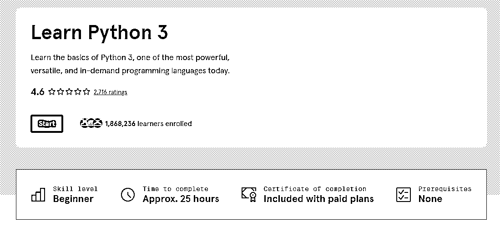

# Codecademy 有很多免费课可以学

> 原文：[`www.yuque.com/for_lazy/xkrm14/el942cgvg73k62up`](https://www.yuque.com/for_lazy/xkrm14/el942cgvg73k62up)

作者： 超级玛丽

日期：2023-03-27

点赞数：24

<ne-hole id="u368ce089" data-lake-id="u368ce089"><ne-card data-card-name="hr" data-card-type="block" id="fr0f4" data-event-boundary="card">

正文：

Codecademy 有很多免费课可以学比如 C++， java, python 等[Just+a+moment...](https://www.codecademy.com/)

<ne-card data-card-name="image" data-card-type="inline" id="B1OqT" data-event-boundary="card">  <ne-p id="u57aff63a" data-lake-id="u57aff63a"><ne-card data-card-name="image" data-card-type="inline" id="Xbu63" data-event-boundary="card">  <ne-hole id="uffb1c911" data-lake-id="uffb1c911"><ne-card data-card-name="hr" data-card-type="block" id="DKJzJ" data-event-boundary="card"><ne-p id="ufaadb941" data-lake-id="ufaadb941">评论区：

影擎 : 老牌网课平台了

超级玛丽 : 啊 是嘛 我都不知道这种 现在有了 chatGPT 这种是不是要下线了 或者有没有可能用 chatGPT 做一个这样的平台 我觉得对于小朋友编程课程或者小白选手来讲，这种有没有需求？

<ne-hole id="u580d9e89" data-lake-id="u580d9e89"><ne-card data-card-name="hr" data-card-type="block" id="LZIyy" data-event-boundary="card">

公众号懒人找资源，懒人专属群分享

</ne-card></ne-hole></ne-card></ne-hole></ne-card></ne-p></ne-card></ne-p></ne-card></ne-hole>