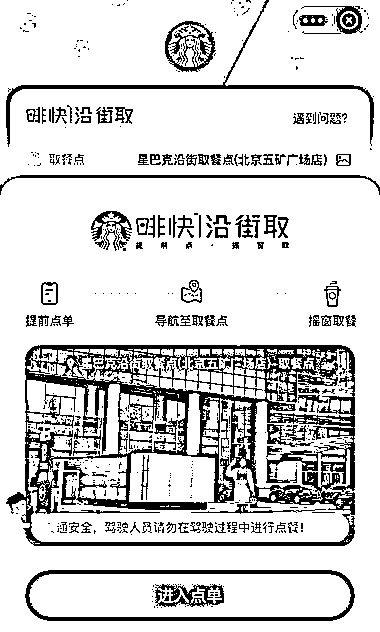
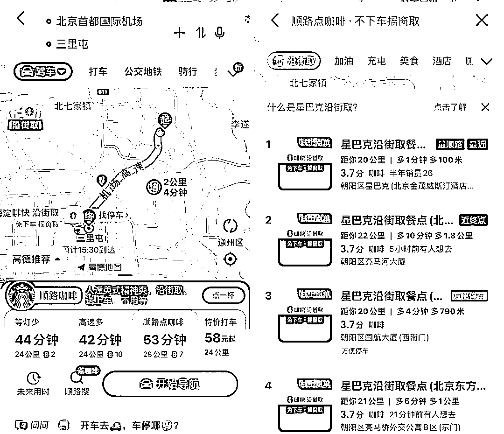

# 星巴克宣布和高德联手打造的全新零售渠道「沿街取」正式登场

> 原文：[`www.yuque.com/for_lazy/xkrm14/cuegmctqeabwprnb`](https://www.yuque.com/for_lazy/xkrm14/cuegmctqeabwprnb)

<ne-p id="ueefff9b9" data-lake-id="ueefff9b9"><ne-text id="ue5909a10">作者： 阿黎</ne-text></ne-p> <ne-p id="u79239757" data-lake-id="u79239757"><ne-text id="u532a4c22">日期：2023-03-24</ne-text></ne-p> <ne-p id="u32d3a170" data-lake-id="u32d3a170"><ne-text id="u36350252">点赞数：</ne-text><ne-text id="u2aaece56" ne-bold="true">30</ne-text></ne-p> <ne-hole id="u90f43c74" data-lake-id="u90f43c74"><ne-card data-card-name="hr" data-card-type="block" id="Adwm1" data-event-boundary="card"><ne-p id="u8821b2b2" data-lake-id="u8821b2b2"><ne-text id="u428e4615">正文：</ne-text></ne-p> <ne-p id="u11559c45" data-lake-id="u11559c45"><ne-text id="uaae6253a">星巴克宣布和高德联手打造的全新零售渠道「沿街取」正式登场。 瞄准了开车的用户，把第三空间延伸到了「路上」。</ne-text> <ne-text id="u1d256942">会有更多相关品牌，平台，试点城市，试点区域，跑步跟上 每一个方面的因素，都有机会 比如，机场那么大，咖啡只有一两家，我赶时间，还得穿越半个机场去取，不喝了。</ne-text> <ne-text id="u999decd7">但如果有人在安检后面等我，我次次下。</ne-text> <ne-text id="u9264951f">在这个真空期，可以招一批美团小哥，延伸出类似服务，负责一个区域，比如代取某个商场的所有外卖品牌，在商场路边等下单的客户:</ne-text> <ne-text id="u6bc54b30">车牌 888 的李女士您好，这是您的 KFC 和喜茶，请慢用，用餐愉快，再见</ne-text></ne-p> <ne-p id="uac6de471" data-lake-id="uac6de471"><ne-card data-card-name="image" data-card-type="inline" id="TQl5l" data-event-boundary="card">  <ne-p id="u1fed4cf6" data-lake-id="u1fed4cf6"><ne-card data-card-name="image" data-card-type="inline" id="SfcLb" data-event-boundary="card">  <ne-p id="u8b3c260d" data-lake-id="u8b3c260d"><ne-card data-card-name="image" data-card-type="inline" id="W368S" data-event-boundary="card">  <ne-p id="u4041aabf" data-lake-id="u4041aabf"><ne-card data-card-name="image" data-card-type="inline" id="zsSRE" data-event-boundary="card">  <ne-hole id="uabdfcecb" data-lake-id="uabdfcecb"><ne-card data-card-name="hr" data-card-type="block" id="Qc0ua" data-event-boundary="card"><ne-p id="u6f023961" data-lake-id="u6f023961"><ne-text id="udd0473f8">评论区：</ne-text></ne-p> <ne-p id="u866086d8" data-lake-id="u866086d8"><ne-text id="u90d0c6f4">Luke 王子 : 让我想起了 美国麦当劳和高速收费站合作 ，进闸顺便点一份餐了</ne-text></ne-p> <ne-p id="ua047e4b2" data-lake-id="ua047e4b2"><ne-text id="u713f2b9b">阿黎 : 这个服务不错 和现在一些加油站加满 xx 元，送洗车一样</ne-text></ne-p> <ne-hole id="u4174e2d6" data-lake-id="u4174e2d6"><ne-card data-card-name="hr" data-card-type="block" id="uGLsn" data-event-boundary="card"><ne-p id="ub87d9075" data-lake-id="ub87d9075"><ne-text id="u237d983b">公众号懒人找资源，懒人专属群分享</ne-text></ne-p></ne-card></ne-hole></ne-card></ne-hole></ne-card></ne-p></ne-card></ne-p></ne-card></ne-p></ne-card></ne-p></ne-card></ne-hole>