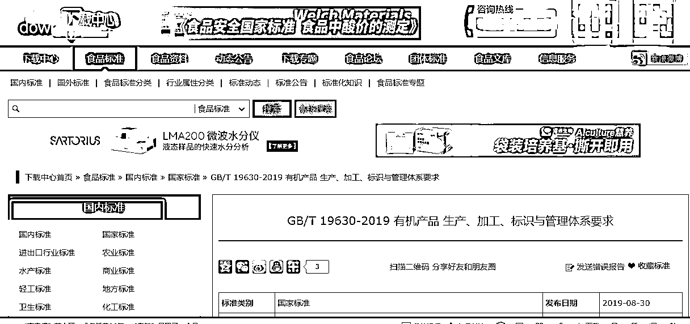

# 标准的资源站，直接捐赠获得下载链接，访问量还不错

> 原文：[`www.yuque.com/for_lazy/xkrm14/ebaylve0dm9gverx`](https://www.yuque.com/for_lazy/xkrm14/ebaylve0dm9gverx)

作者： 施霖终生学习者-链接

日期：2023-03-24

点赞数：57

<ne-card data-card-name="hr" data-card-type="block" id="rEzl7" data-event-boundary="card">

正文：

关于标准的资源站 今天准备下载一个标准，结果看到有人做的这种网站， 直接捐赠获得下载链接，访问量还不错！ 其实这些标准在官网都可以找到，免费下载， 用爬虫还可以爬下来！ 针对不同的行业，放不同的标准！ 比如：绿色食品标准就有几百个， 有机产品标准！ 特别是食品药品的标准非常多！ 很多厂家在执行时，要注意同时满足标准标识的要求 才不会被市场监督管理局处罚。 这个做好 SEO 和关键词，还是很香的， 分享给各位，看有圈友有执行力没得！ 另外因为在资料整理航海，大家昨天顺利靠岸！ 90%以上的靠岸率还是非常不错的！ 所以最近对资料整理的赛道有点小研究！ 祝生财有术啊！

<ne-card data-card-name="image" data-card-type="inline" id="o7Xkb" data-event-boundary="card">  <ne-p id="u14ae303f" data-lake-id="u14ae303f"><ne-card data-card-name="image" data-card-type="inline" id="IPPIW" data-event-boundary="card">  <ne-p id="ubb66971f" data-lake-id="ubb66971f"><ne-card data-card-name="image" data-card-type="inline" id="aeeip" data-event-boundary="card">  <ne-p id="u2394b45a" data-lake-id="u2394b45a"><ne-card data-card-name="image" data-card-type="inline" id="l7PZt" data-event-boundary="card">  <ne-p id="u52ef051b" data-lake-id="u52ef051b"><ne-card data-card-name="image" data-card-type="inline" id="qFDxr" data-event-boundary="card">  <ne-card data-card-name="hr" data-card-type="block" id="Hof4o" data-event-boundary="card"><ne-p id="u5e63d347" data-lake-id="u5e63d347">评论区：

莫默 : 话说我两年前毕业没多久就在公司有做过这种 标准 网页，当时就只是做，没想到能利用整合资源搞流量

施霖终生学习者-链接 : 你有经验，搞起来，其实类似的资源，不仅是标准可以做， 还有地方法律法规的政策，也可以的，我研究过，每个地方颁布的地方法律法规都不一样，同时又不断废止，说白了，就是做了基础收集，更新，整理，保持最新呈现！ 细分赛道，很香的，刚需！ 还可以延伸延展， 就是简历服务，收集很多模板 做工程用的招投标的，相关设备参数资料等， 把大家习以为常的东西收集整理成了系列，就成了数据库，只要是成库的资源，包装下，都有细分的需求！ 一起生财有术啊，

<ne-card data-card-name="hr" data-card-type="block" id="xk8dB" data-event-boundary="card">

公众号懒人找资源，懒人专属群分享

</ne-card></ne-card></ne-card></ne-p></ne-card></ne-p></ne-card></ne-p></ne-card></ne-p></ne-card></ne-p></ne-card>