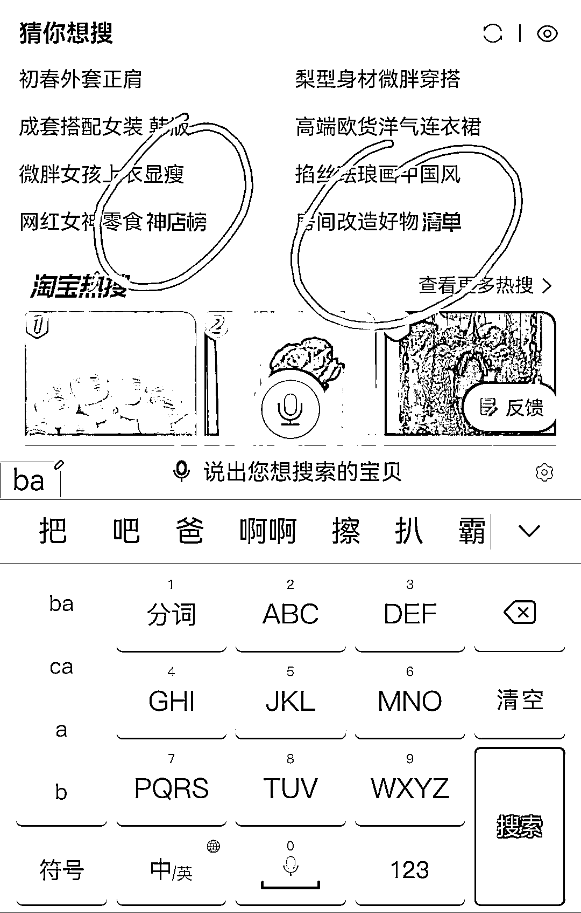
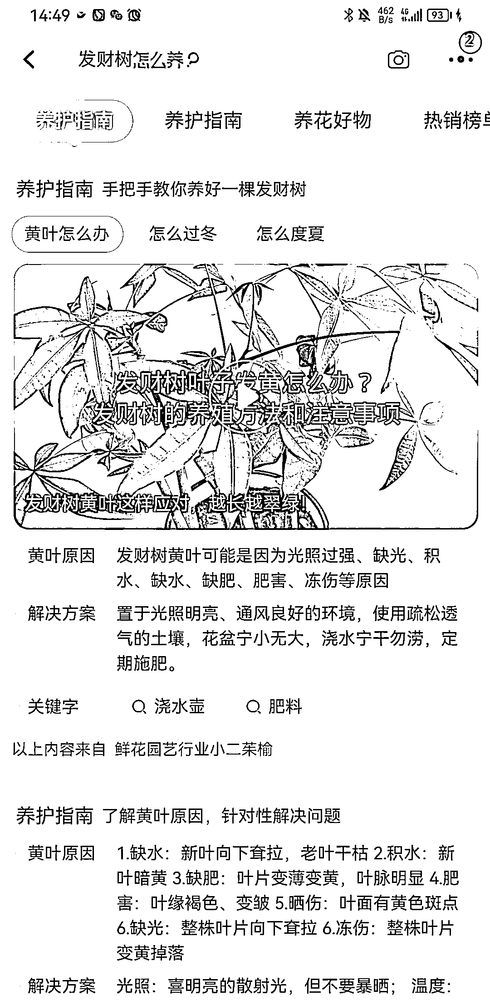

# 淘宝开始细化做内容了

> 原文：[`www.yuque.com/for_lazy/xkrm14/zgbnat1qfyh6rguo`](https://www.yuque.com/for_lazy/xkrm14/zgbnat1qfyh6rguo)

作者： 西西

日期：2023-03-31

点赞数：44

正文：

淘宝开始细化做内容了 淘宝打开，搜索框出现红色关键词，进入竟然有百科了，图 1，另外推荐的长尾关键词开始出现：清单体、怎么、是什么、神店榜，回购榜，还有养护指南。 标题热点，好物热点排行，做电商及种草的宝子可以借用了～

  

  

  

  

  

  

评论区：

兰心 : 多了选品渠道[鼓掌]

Luke 王子 : 好思路！

公众号懒人找资源，懒人专属群分享

</ne-p></ne-p></ne-p></ne-p></ne-p></ne-p>