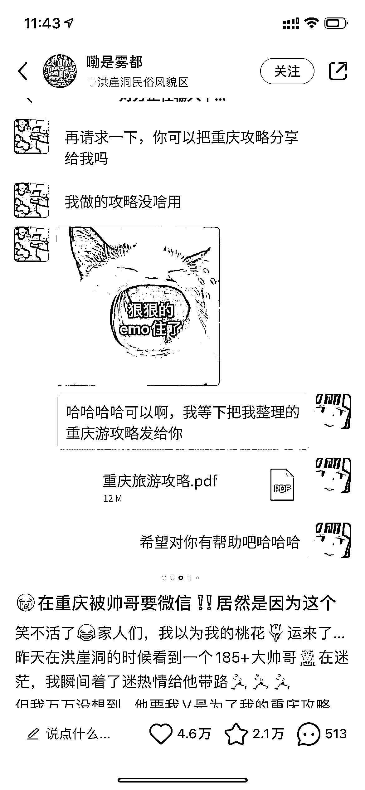

# 小红书爆款模板-讲故事

> 原文：[`www.yuque.com/for_lazy/xkrm14/nofe8u46r1u3iogn`](https://www.yuque.com/for_lazy/xkrm14/nofe8u46r1u3iogn)

作者： 沐文

日期：2023-03-31

点赞数：79

<ne-card data-card-name="hr" data-card-type="block" id="ZUhoX" data-event-boundary="card">

正文：

小红书爆款模板---讲故事 一个好友添加、一个路人搭讪，慢慢的故事感 后续就是要一个资料、要一个指南、要一个产品链接等等 所谓开局一张图，后续全靠编 小红书人群吃这个梗

<ne-card data-card-name="image" data-card-type="inline" id="Lgs0J" data-event-boundary="card">  <ne-p id="u51da2a15" data-lake-id="u51da2a15"><ne-card data-card-name="image" data-card-type="inline" id="wp5NR" data-event-boundary="card">  <ne-p id="ua34c62ab" data-lake-id="ua34c62ab"><ne-card data-card-name="image" data-card-type="inline" id="xsfKh" data-event-boundary="card">  <ne-card data-card-name="hr" data-card-type="block" id="VbumK" data-event-boundary="card"><ne-p id="u98ff475c" data-lake-id="u98ff475c">评论区：

lorraine : 大家都愿意相信美好事物的发生[偷笑]

<ne-card data-card-name="hr" data-card-type="block" id="NsGtL" data-event-boundary="card">

公众号懒人找资源，懒人专属群分享

</ne-card></ne-card></ne-card></ne-p></ne-card></ne-p></ne-card></ne-p></ne-card>