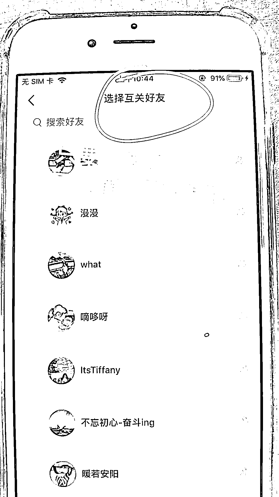
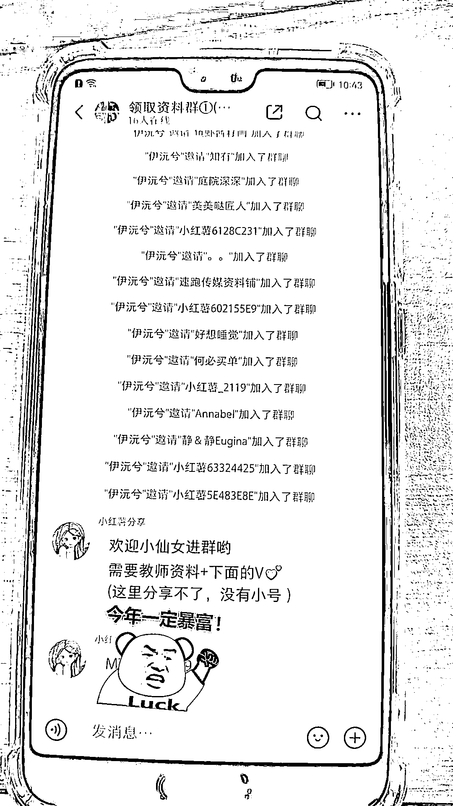

# 小红书互关可以直接拉群引流

> 原文：[`www.yuque.com/for_lazy/xkrm14/felmb736vd038056`](https://www.yuque.com/for_lazy/xkrm14/felmb736vd038056)

作者： 老彭

日期：2023-03-31

点赞数：46

正文：

这招引流太绝啦！ 图 1，我刷到这个作者的笔记，下面全是求分享的评论，其中有个小号在引导关注，即所谓的一键三.连，于是我关注了，想看看他怎么发资料给我。 结果我直接被拉入了图 3 的群聊，刚开始我还很懵“她是怎么拉我进群的？”，于是我回到了自己的账号看群聊，原来互关的可以直接拉群（图 2），难怪他要引导我们关注呢... 这效率很高啊！

  

  

  

评论区：

My Dream : 这种应该很容易引起别人的反感吧，毕竟别人不是自愿加群的

莫默 : 这是用了啥黑科技

老彭 : 不会，本来就是为了领资料才关注的

张老师 : 40 人以内，都可以，之前航海讲过

公众号懒人找资源，懒人专属群分享

</ne-p></ne-p></ne-p>