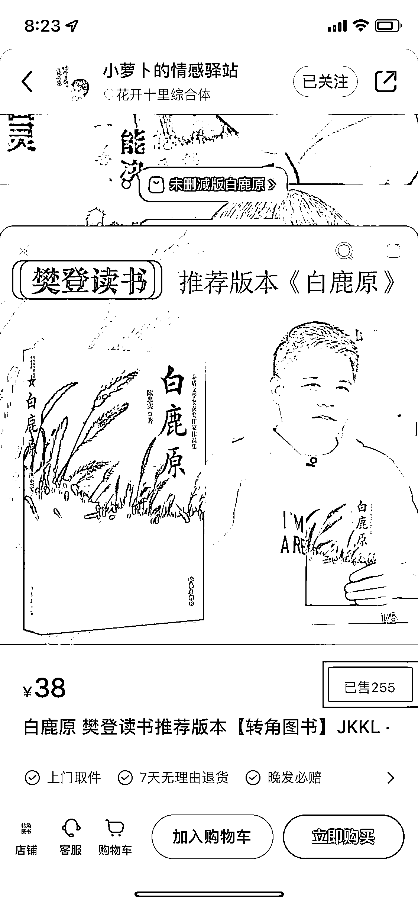

# 小红书，情感类故事账号，带货数据好

> 原文：[`www.yuque.com/for_lazy/xkrm14/nnsqz0vfqsgoyofc`](https://www.yuque.com/for_lazy/xkrm14/nnsqz0vfqsgoyofc)

作者： 金色大街

日期：2023-03-31

点赞数：24

<ne-card data-card-name="hr" data-card-type="block" id="bEch2" data-event-boundary="card">

正文：

小红书情感类明星类故事类账号，笔记内容其实就是一些情感类公众号和微博讲烂的故事，图上直接挂对应的书，销量还不错。

<ne-card data-card-name="image" data-card-type="inline" id="NnYVe" data-event-boundary="card">  <ne-p id="u2ba99d5d" data-lake-id="u2ba99d5d"><ne-card data-card-name="image" data-card-type="inline" id="e0Iou" data-event-boundary="card">  <ne-card data-card-name="hr" data-card-type="block" id="KbVW0" data-event-boundary="card"><ne-p id="uf302e2f7" data-lake-id="uf302e2f7">评论区：

彬 : 带书要自己开店吧

<ne-card data-card-name="hr" data-card-type="block" id="XB0ZC" data-event-boundary="card">

公众号懒人找资源，懒人专属群分享

</ne-card></ne-card></ne-card></ne-p></ne-card></ne-p></ne-card>