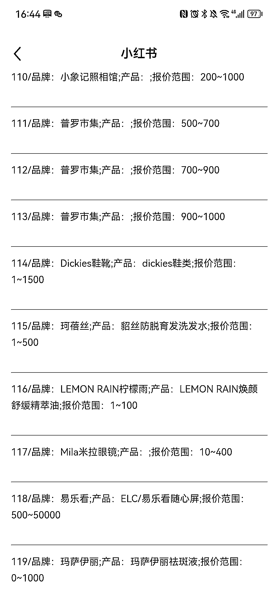
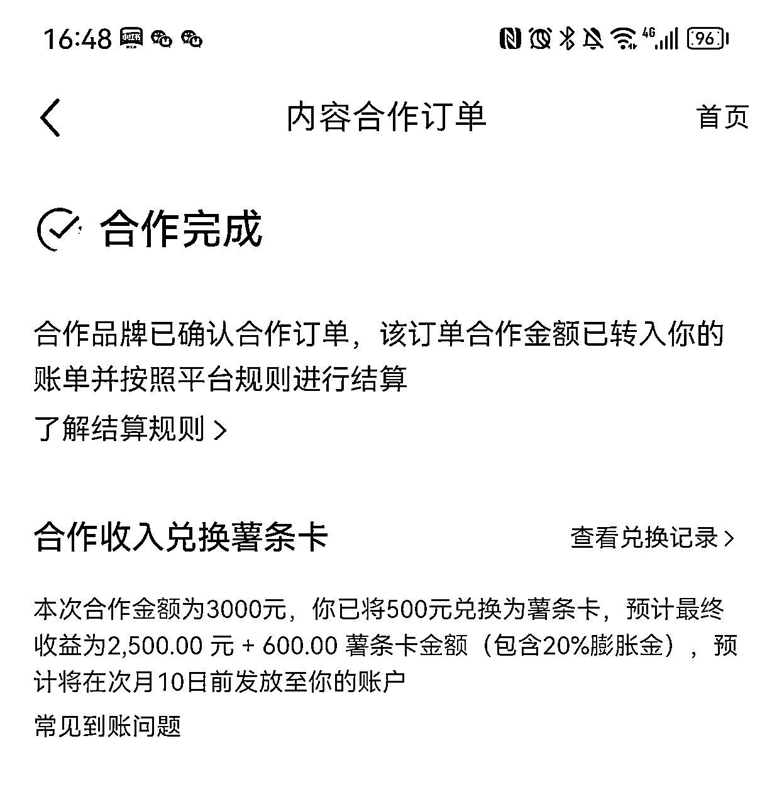

# 小红书接广告，除了蒲公英还可以进入乘风专区

> 原文：[`www.yuque.com/for_lazy/xkrm14/nqopz5duthb3irky`](https://www.yuque.com/for_lazy/xkrm14/nqopz5duthb3irky)

作者： 蓝子鱼

日期：2023-03-30

点赞数：49

<ne-card data-card-name="hr" data-card-type="block" id="qbYnl" data-event-boundary="card">

正文：

在小红书里面接广告，不仅可以在蒲公英平台，看到平台推荐的，还可以进入乘风专区，这个是自己选择报名，每周一三五都会更新上百条广告。 各种类型都有，美妆，线下探店，小家电都有，比较适合粉丝比较少，没什么人主动练习的博主。我就在里面接到一条 3000 的广告。

<ne-card data-card-name="image" data-card-type="inline" id="NGQNd" data-event-boundary="card">  <ne-p id="u8f97c31b" data-lake-id="u8f97c31b"><ne-card data-card-name="image" data-card-type="inline" id="E2HgE" data-event-boundary="card">  <ne-p id="ub13c601b" data-lake-id="ub13c601b"><ne-card data-card-name="image" data-card-type="inline" id="pAOQT" data-event-boundary="card">  <ne-card data-card-name="hr" data-card-type="block" id="fnM6q" data-event-boundary="card"><ne-p id="ucf30d8bb" data-lake-id="ucf30d8bb">评论区：

<ne-card data-card-name="hr" data-card-type="block" id="fD228" data-event-boundary="card">

公众号懒人找资源，懒人专属群分享

</ne-card></ne-card></ne-card></ne-p></ne-card></ne-p></ne-card></ne-p></ne-card>