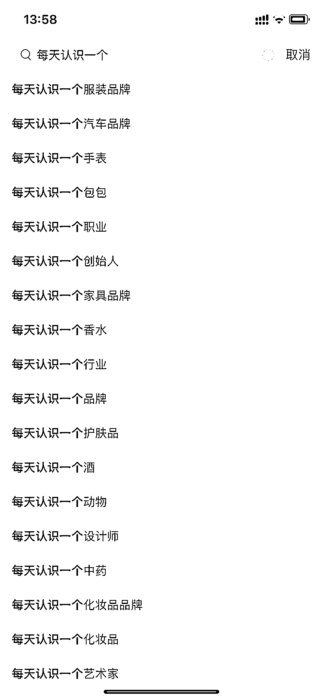

# 小红书：低成本高效涨粉方法

> 原文：[`www.yuque.com/for_lazy/xkrm14/xl36g18056hqgbtd`](https://www.yuque.com/for_lazy/xkrm14/xl36g18056hqgbtd)

作者： 王马扎

日期：2023-03-30

点赞数：103

正文：

【小红书一个低成本高效涨粉方法】 图二中的账号从 3 月 13 日起号，到今天，不到一个月涨粉 8.5 万。 可借鉴的点： 1）统一话题：每天认识一个 XX，可以是一个汽车品牌、一个新行业、一个新赛道等等，见图一。 2）内容风格统一且内容输出成本很低（可以结合 chatgpt 输出内容） 关键一点是可以切行业，图一中可以看到，可以根据自己的赛道去批量生产内容。

  

  

评论区：

七彩园林---张文超 : 我是做园林的，每天认识一个新植物

许义 : 这个怎么变现呢

王马扎 : 可以引流到私域

公众号懒人找资源，懒人专属群分享

</ne-p></ne-p>