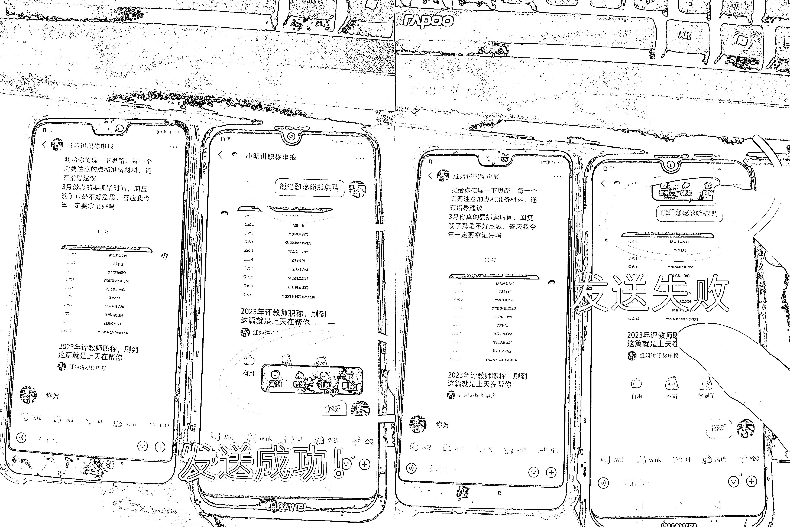

# 小红书 5 个私信技巧分享

> 原文：[`www.yuque.com/for_lazy/xkrm14/wa42792cfieb3mk9`](https://www.yuque.com/for_lazy/xkrm14/wa42792cfieb3mk9)

作者： 老彭

日期：2023-03-29

点赞数：38

正文：

【分享 5 个小红书私信小技巧】 1、私信时，如果长按信息没有「引用」标签，那就是信息没有发布成功（图 1） 因为没有发布成功，所以无法引用，应该很好理解。我就不举更多的例子了，虽然我得出这个结论的总案例数量不算多，但我也并不是仅此一例就推断出这个结论的，大家也可以自己测试一下。 有什么用？我们做小红书引流的时候，如果发布出去的信息没有成功，那就是在做无用功，浪费时间又废号，比如我们发送自己的联系方式时、我们在评论区主动私信用户时。 如果我们有办法可以判断自己的私信有没发送成功，那么在发送联系方式时，就可以及时换成图片的形式而不是文字；还有，可以在主动私信用户时，及早停止工作，既节省了时间，也缓了时间让账号走出异常，而不是依然疯狂私信用户直到账号被官方提醒违规。 2、私信时可以分享笔记，囊括「点赞」「收藏」「我的笔记」「历史浏览」 （图 2） 很多做小红书引流的圈友可能没有注意到这点，其实也很有用。比如我到同行的评论区引流时，我会在“历史浏览”里把他评论过的发给他，用户常常以为商家就是我，又或者他评论过我的笔记但实际上我希望他可以私信，于是直接把我那篇笔记发给他，引导用户转移到私信 3、私信也可以设置快捷回复（图 3） 做小红书引流的圈友，应该都有几套话术应对不同的用户，设置快捷回复就可以了。比如有人关注时，可以设置“你好！感谢关注，我是 5 年服务于职称申报的老彭，请问有什么可以帮到您？” 4、私信时可以发送商品（图 4） 如果开通了小红书店铺，就可以私信时直接发送用户感兴趣的商品了。比如很多用户虽然在评论求链接，但是她并没有到店铺直接购买，这时我们就可以给她发个商品链接了，或者引导她不懂哪里买就私信，然后再发商品。 5、自定义表情(图 5) 如果发送引导加微信的图片经常违规，不妨试试把图片制作成自定义表情

  

  

  

评论区：

许义 : 你好，小红书历史浏览在哪里看，好像没有找到

老彭 : 期待《小红书变现》

公众号懒人找资源，懒人专属群分享

