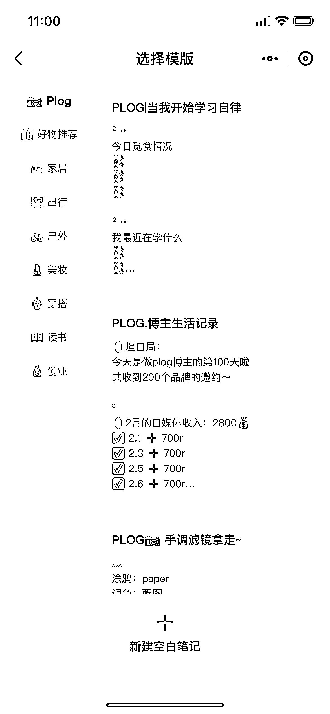

# 小红书工具分享：红薯编辑器

> 原文：[`www.yuque.com/for_lazy/xkrm14/kspwdnt2arc8o9rm`](https://www.yuque.com/for_lazy/xkrm14/kspwdnt2arc8o9rm)

作者： 北斗

日期：2023-03-29

点赞数：121

正文：

分享一个小红书笔记编辑器，叫红薯编辑器，可以自动编辑笔记模版，有各种 emoji，写完笔记直接点违规检测，不用二次放到零克查词了

  

  

评论区：

老彭 : 不错，有链接吗

北斗 : 小程序

惊叹号 : 红薯编辑器

公众号懒人找资源，懒人专属群分享

</ne-p></ne-p>