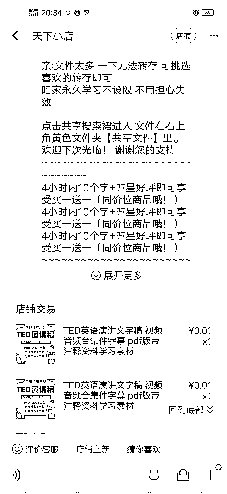

# 淘宝上一个高效引流方法，一天可以引流满五六个百度群

> 原文：[`www.yuque.com/for_lazy/xkrm14/qounq63vakckqffk`](https://www.yuque.com/for_lazy/xkrm14/qounq63vakckqffk)

<ne-p id="uf7987e72" data-lake-id="uf7987e72"><ne-text id="u31bb11dc">作者： 星夜</ne-text></ne-p> <ne-p id="ua05c190e" data-lake-id="ua05c190e"><ne-text id="ufcccebb7">日期：2023-03-28</ne-text></ne-p> <ne-p id="u24a1c5f2" data-lake-id="u24a1c5f2"><ne-text id="u504237da">点赞数：</ne-text><ne-text id="ud4bc6926" ne-bold="true">45</ne-text></ne-p> <ne-hole id="uc141a82d" data-lake-id="uc141a82d"><ne-card data-card-name="hr" data-card-type="block" id="FFTRT" data-event-boundary="card"><ne-p id="uc0ef5d65" data-lake-id="uc0ef5d65"><ne-text id="ua812df4e">正文：</ne-text></ne-p> <ne-p id="u0a83bf27" data-lake-id="u0a83bf27"><ne-text id="u8e442e0d">最近看了大佬的图文号做 ted 然后去淘宝看一下 有一个高效引流方法 几十块的 ted 教材卖 1 分钱，然后教程加水印引流私域，一天引流满五六个百度群 上千人</ne-text> <ne-text id="uefb4a34c">这个方法可以借鉴</ne-text></ne-p> <ne-p id="uc3773e22" data-lake-id="uc3773e22"><ne-card data-card-name="image" data-card-type="inline" id="Ok7jP" data-event-boundary="card">  <ne-hole id="ue6127805" data-lake-id="ue6127805"><ne-card data-card-name="hr" data-card-type="block" id="bDFv1" data-event-boundary="card"><ne-p id="u4a387c41" data-lake-id="u4a387c41"><ne-text id="ucedce707">评论区：</ne-text></ne-p> <ne-p id="uc2c7c4d8" data-lake-id="uc2c7c4d8"><ne-text id="uf8c035ec">豆豆 : 咋就 33 人买过</ne-text></ne-p> <ne-p id="u0bc77133" data-lake-id="u0bc77133"><ne-text id="u49ce5f53">星夜 : 👏👏👏👏</ne-text></ne-p> <ne-hole id="u4b4a9612" data-lake-id="u4b4a9612"><ne-card data-card-name="hr" data-card-type="block" id="Tpfs6" data-event-boundary="card"><ne-p id="u41aee349" data-lake-id="u41aee349"><ne-text id="u2eada498">公众号懒人找资源，懒人专属群分享</ne-text></ne-p></ne-card></ne-hole></ne-card></ne-hole></ne-card></ne-p></ne-card></ne-hole>