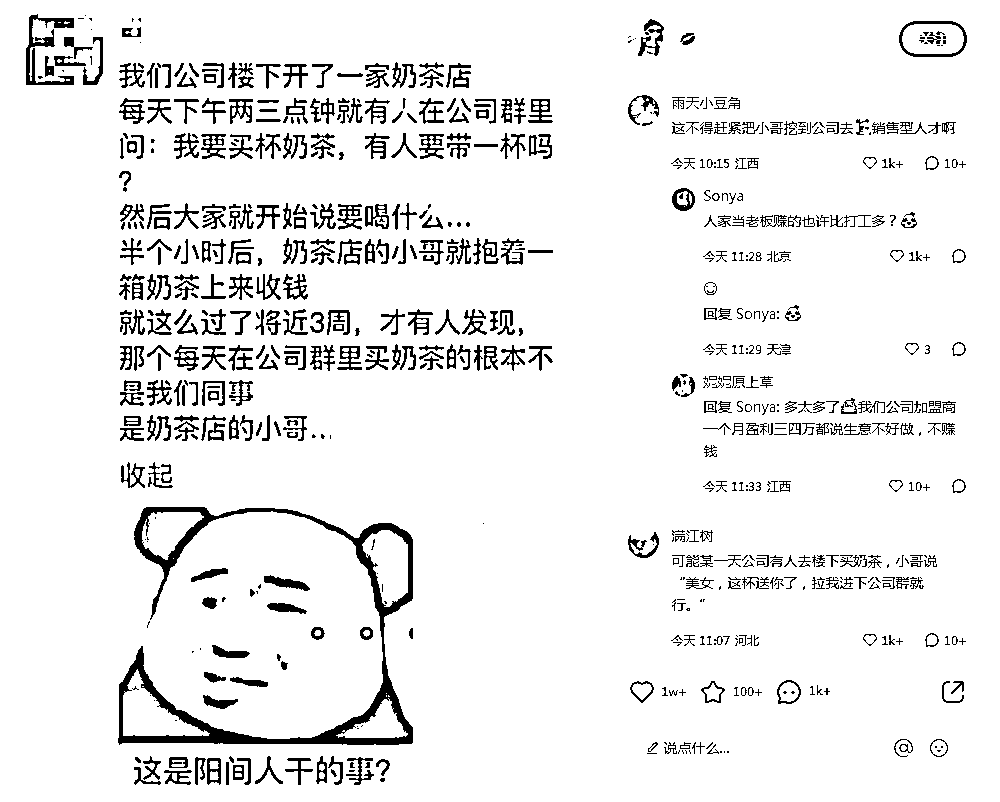
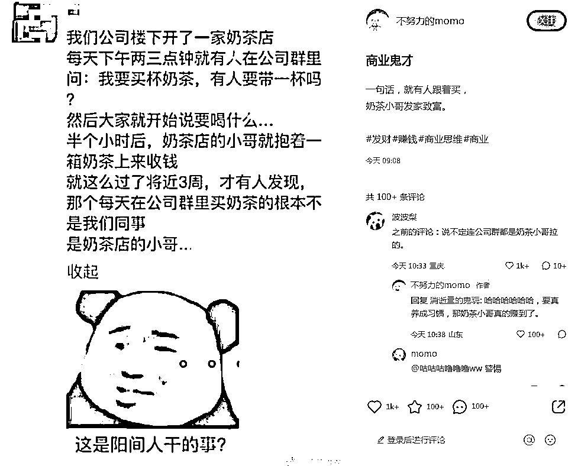
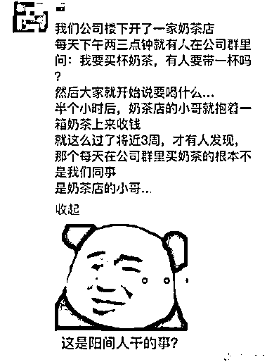

# 小红书低粉爆文换标题重发，依然能爆

> 原文：[`www.yuque.com/for_lazy/xkrm14/bs2lz1shhcz5pat7`](https://www.yuque.com/for_lazy/xkrm14/bs2lz1shhcz5pat7)

<ne-p id="uc2ac973a" data-lake-id="uc2ac973a"><ne-text id="u96581771">作者： 糯米糕</ne-text></ne-p> <ne-p id="u7378afdc" data-lake-id="u7378afdc"><ne-text id="ube82b7f7">日期：2023-03-28</ne-text></ne-p> <ne-p id="u81368a90" data-lake-id="u81368a90"><ne-text id="ua27b84a2">点赞数：</ne-text><ne-text id="u2fc1b4a4" ne-bold="true">33</ne-text></ne-p> <ne-hole id="u923a8591" data-lake-id="u923a8591"><ne-card data-card-name="hr" data-card-type="block" id="ZQ3ge" data-event-boundary="card"><ne-p id="ua4240d73" data-lake-id="ua4240d73"><ne-text id="ubaab641a">正文：</ne-text></ne-p> <ne-p id="u8da4ea15" data-lake-id="u8da4ea15"><ne-text id="u63b05962">小红书低粉爆文换标题重发，依然能爆。</ne-text> <ne-text id="u357996c5">图 1 是本月 12 日的低粉爆文，图 2 是今天的实时笔记榜排 14 位，图 3 是笔记图片，直接搬运的，图 4 是搬运的笔记数据。只过了半个月，搬运的数据依然好。</ne-text></ne-p> <ne-p id="u06f93339" data-lake-id="u06f93339"><ne-card data-card-name="image" data-card-type="inline" id="BnUgM" data-event-boundary="card">  <ne-p id="u8c456b85" data-lake-id="u8c456b85"><ne-card data-card-name="image" data-card-type="inline" id="fVr3t" data-event-boundary="card">  <ne-p id="u69d77599" data-lake-id="u69d77599"><ne-card data-card-name="image" data-card-type="inline" id="qtg0B" data-event-boundary="card">  <ne-p id="u8a6feca0" data-lake-id="u8a6feca0"><ne-card data-card-name="image" data-card-type="inline" id="fMToT" data-event-boundary="card">  <ne-hole id="u7485e1e3" data-lake-id="u7485e1e3"><ne-card data-card-name="hr" data-card-type="block" id="z9qQu" data-event-boundary="card"><ne-p id="u1cc1242f" data-lake-id="u1cc1242f"><ne-text id="u0f906016">评论区：</ne-text></ne-p> <ne-p id="uc8ef3f15" data-lake-id="uc8ef3f15"><ne-text id="u337d3de1">小张 : 图文都不改？</ne-text></ne-p> <ne-p id="u5abc20e2" data-lake-id="u5abc20e2"><ne-text id="u858ed5ac">黄岛主 : 这个已经是常态了</ne-text></ne-p> <ne-p id="uc25e3fbf" data-lake-id="uc25e3fbf"><ne-text id="u2e6213fa">糯米糕 : 不改，只换了个标题。</ne-text></ne-p> <ne-p id="ue94645ea" data-lake-id="ue94645ea"><ne-text id="u8c3d078d">小张 : 这么狠 竟然不限流</ne-text></ne-p> <ne-p id="u8e4cabb7" data-lake-id="u8e4cabb7"><ne-text id="u83ab5659">情感指导（同城相亲） : 这是发同个账号上，还是不同账号上</ne-text></ne-p> <ne-p id="uffda5814" data-lake-id="uffda5814"><ne-text id="u4f000ceb">wz 斌 : 用一个账号的</ne-text></ne-p> <ne-hole id="u966a2d5c" data-lake-id="u966a2d5c"><ne-card data-card-name="hr" data-card-type="block" id="q9GId" data-event-boundary="card"><ne-p id="ub7971ad7" data-lake-id="ub7971ad7"><ne-text id="u38ddc9cc">公众号懒人找资源，懒人专属群分享</ne-text></ne-p></ne-card></ne-hole></ne-card></ne-hole></ne-card></ne-p></ne-card></ne-p></ne-card></ne-p></ne-card></ne-p></ne-card></ne-hole>