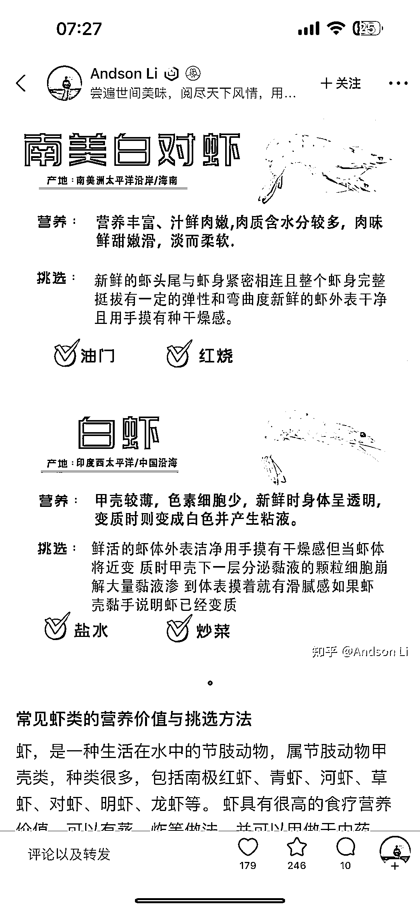
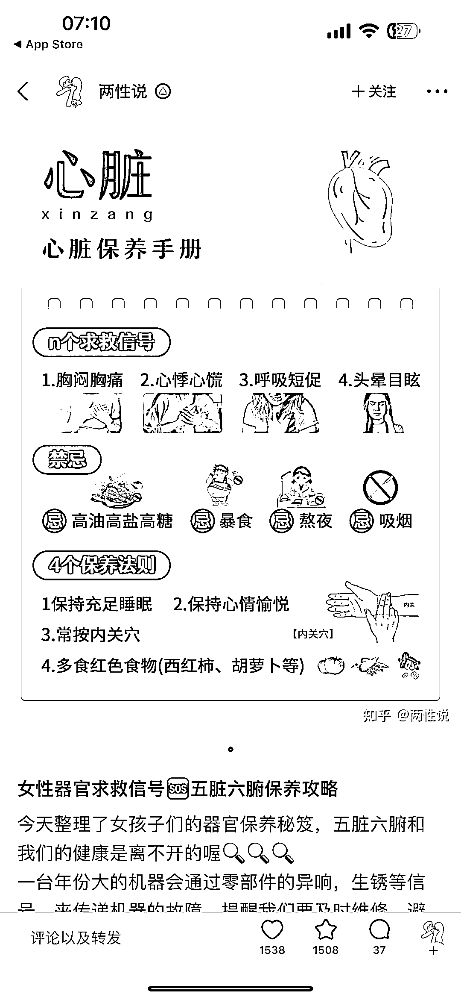
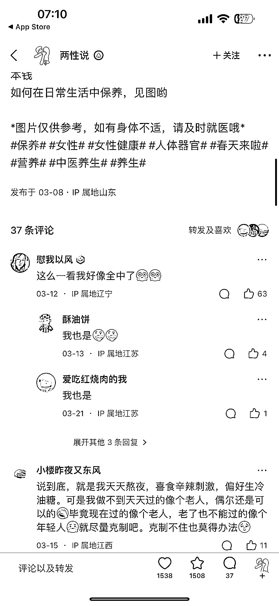

# 知乎版「小红书」来了，知乎也开始做短内容

> 原文：[`www.yuque.com/for_lazy/xkrm14/hirkzpy4wtm0s798`](https://www.yuque.com/for_lazy/xkrm14/hirkzpy4wtm0s798)

作者： 斑马森林

日期：2023-03-28

点赞数：34

<ne-hole id="uf95e721f" data-lake-id="uf95e721f"><ne-card data-card-name="hr" data-card-type="block" id="ntHf8" data-event-boundary="card">

正文：

知乎版「小红书」来了，知乎也开始做短内容，“想法”改版了，和小红书类似，短内容创作者多了一个分发平台，做知乎好物的可以关注下这个板块

<ne-card data-card-name="image" data-card-type="inline" id="rQi4k" data-event-boundary="card">  <ne-p id="u8fd5a4d9" data-lake-id="u8fd5a4d9"><ne-card data-card-name="image" data-card-type="inline" id="m2s5j" data-event-boundary="card">  <ne-p id="u90c03c05" data-lake-id="u90c03c05"><ne-card data-card-name="image" data-card-type="inline" id="ClieG" data-event-boundary="card">  <ne-p id="u001e6f0f" data-lake-id="u001e6f0f"><ne-card data-card-name="image" data-card-type="inline" id="MKKy2" data-event-boundary="card">  <ne-hole id="u95a67d8c" data-lake-id="u95a67d8c"><ne-card data-card-name="hr" data-card-type="block" id="sGRFa" data-event-boundary="card"><ne-p id="ucc1b755a" data-lake-id="ucc1b755a">评论区：

<ne-hole id="u65791b05" data-lake-id="u65791b05"><ne-card data-card-name="hr" data-card-type="block" id="diDc9" data-event-boundary="card">

公众号懒人找资源，懒人专属群分享

</ne-card></ne-hole></ne-card></ne-hole></ne-card></ne-p></ne-card></ne-p></ne-card></ne-p></ne-card></ne-p></ne-card></ne-hole>