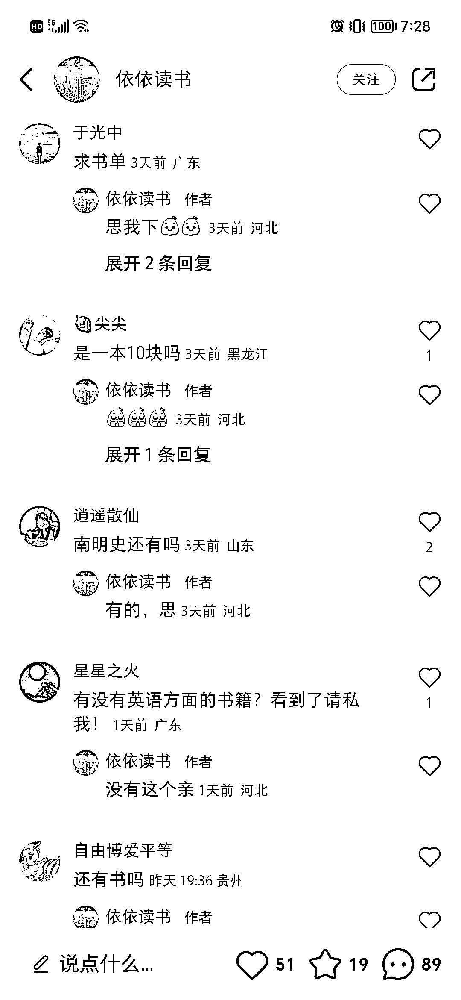
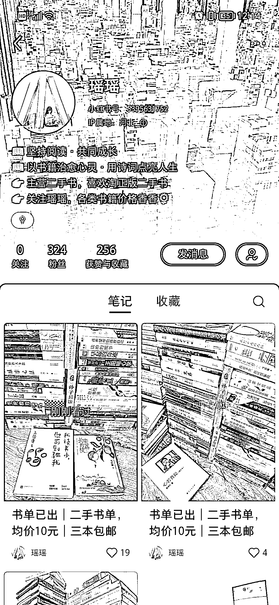

# 小红书图书矩阵引流，全部都是低点赞高评论

> 原文：[`www.yuque.com/for_lazy/xkrm14/mgpi26gu70kpx2a1`](https://www.yuque.com/for_lazy/xkrm14/mgpi26gu70kpx2a1)

作者： 郭超💎 ‍微終極會

日期：2023-03-28

点赞数：23

<ne-hole id="u141098b9" data-lake-id="u141098b9">

正文：

小红书矩阵引流，全部都是低点赞高评论，怎么买

  <ne-p id="u6ce9559b" data-lake-id="u6ce9559b">  <ne-p id="u1331e63b" data-lake-id="u1331e63b">  <ne-p id="u18401597" data-lake-id="u18401597">  <ne-hole id="uef793e36" data-lake-id="uef793e36"><ne-p id="u204f1984" data-lake-id="u204f1984">评论区：

<ne-hole id="u02257dbe" data-lake-id="u02257dbe">

公众号懒人找资源，懒人专属群分享

</ne-hole></ne-hole></ne-p></ne-p></ne-p></ne-p></ne-hole>