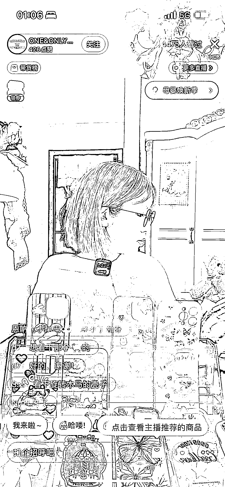

# 小红书店铺直播有平台扶持

> 原文：[`www.yuque.com/for_lazy/xkrm14/kqyftvkkkh2y66im`](https://www.yuque.com/for_lazy/xkrm14/kqyftvkkkh2y66im)

<ne-text id="u64887b4f">作者： 深蓝 blue</ne-text>

<ne-text id="u9fc9b0c9">日期：2023-03-28</ne-text>

<ne-text id="u234ea6a3">点赞数：</ne-text><ne-text id="u7c1b4067" ne-bold="true">41</ne-text>

<ne-hole id="u19e85204" data-lake-id="u19e85204"><ne-card data-card-name="hr" data-card-type="block" id="Ttcx3" data-event-boundary="card">

<ne-text id="uf7c666ac">正文：</ne-text>

<ne-text id="u79187d50">小红书上一个很简单，又很好的生意。 人群对，视频拍摄简单，直播布景简单，外加平台扶持。 现在是凌晨一点多，还有 4000 多人在线。 非常适合复制和副业。</ne-text>

<ne-card data-card-name="image" data-card-type="inline" id="KyKLp" data-event-boundary="card">  <ne-hole id="u40664405" data-lake-id="u40664405"><ne-card data-card-name="hr" data-card-type="block" id="lyfbI" data-event-boundary="card"><ne-p id="u700edcf8" data-lake-id="u700edcf8"><ne-text id="uc40709cd">评论区：</ne-text>

<ne-text id="ueadba4d7">奶爸超人 : 没看懂，卖手机壳？</ne-text>

<ne-text id="u1a9f7b89">Michael : 平台扶持是什么扶持？</ne-text>

<ne-text id="u589a75cb">祝先生 : 是 4 千多人看过 不是 4 千人在线哦</ne-text>

<ne-text id="uba786469">深蓝 blue : 对</ne-text>

<ne-text id="u7557a00f">深蓝 blue : 对，眼花了</ne-text>

<ne-text id="u89a83a76">深蓝 blue : 小红书在推自己的店铺，流量扶持。</ne-text>

<ne-hole id="u1804943e" data-lake-id="u1804943e"><ne-card data-card-name="hr" data-card-type="block" id="uza1R" data-event-boundary="card">

<ne-text id="u263a4fc6">公众号懒人找资源，懒人专属群分享</ne-text>

</ne-card></ne-hole></ne-card></ne-hole></ne-card></ne-p></ne-card></ne-hole>