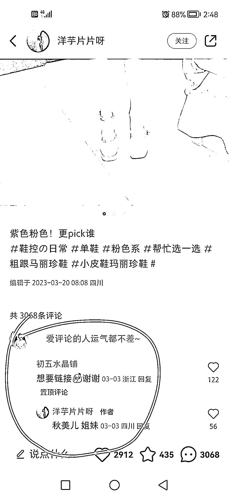

# 小红书简单粗暴高效率的卖货方式分享

> 原文：[`www.yuque.com/for_lazy/xkrm14/ph4gh13vkvkxn6ko`](https://www.yuque.com/for_lazy/xkrm14/ph4gh13vkvkxn6ko)

作者： 老彭

日期：2023-03-27

点赞数：32

正文：

【简单粗暴高效率的卖货方式】 1、小号留意向评论并置顶，大号回复店铺名(可以是自己家的店，也可以是接广告的店，对，因为数据好几百粉丝估计也接了不少广告) 2、采用了小红书很火的「帮选择」内容模板，固定化的封面，固定化的标题(极低的内容生产成本) 3、以她举例，普通女生其实也可以模仿，不要思路受阻，咱们还可以 P 图呀 4、鞋子只是其中一个角度而已，还可以换成丝袜、耳环等，思路都是通用的

评论区：

暂无评论

公众号懒人找资源，懒人专属群分享

