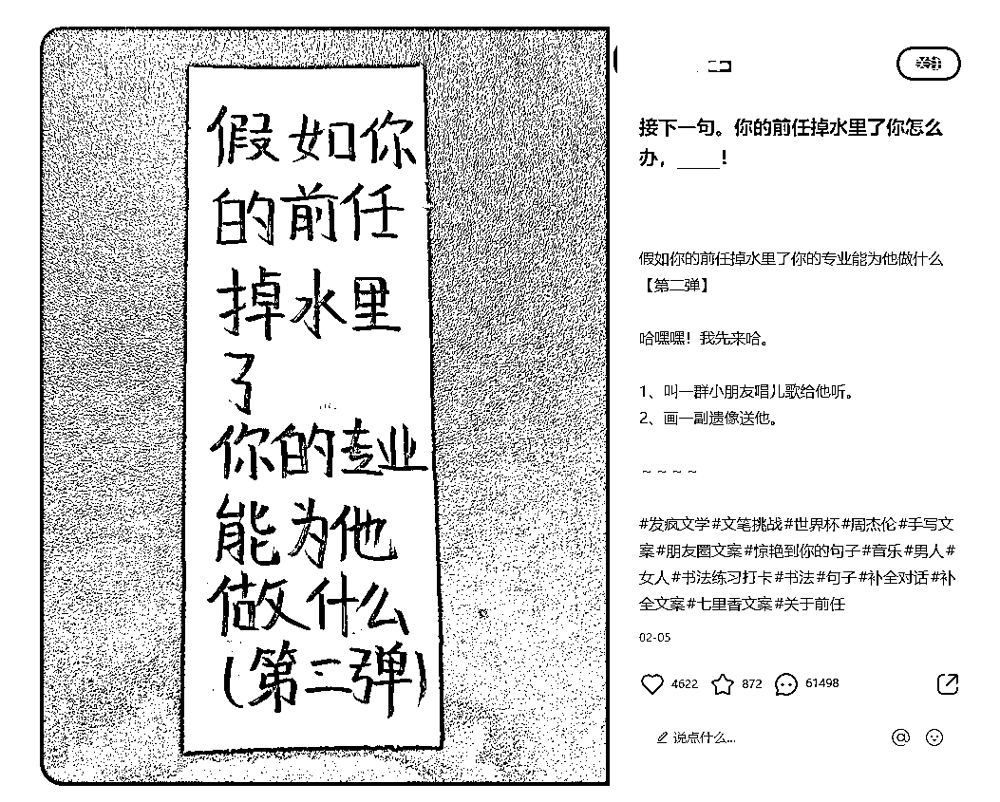
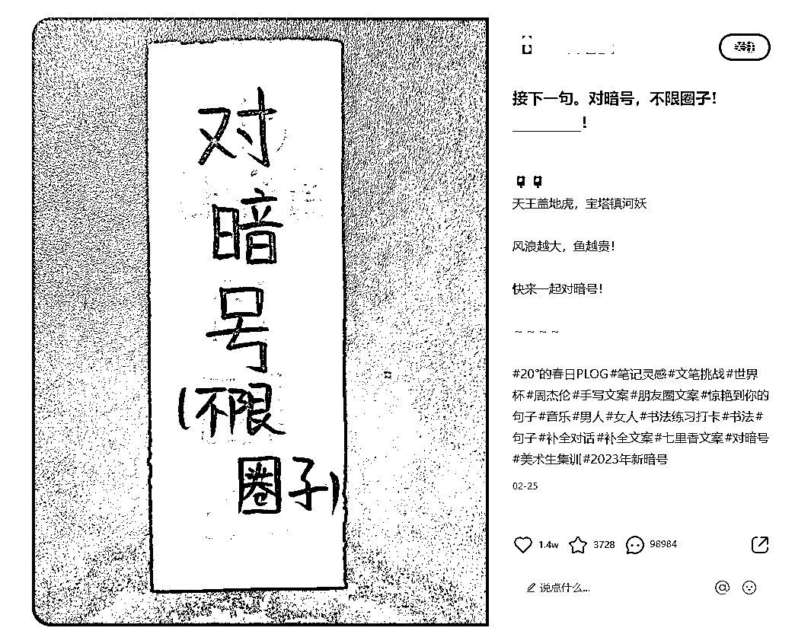
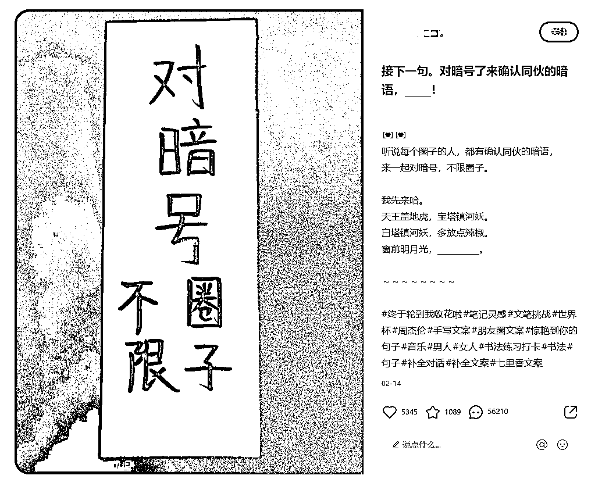

# 小红书行业问题笔记，互动数据好

> 原文：[`www.yuque.com/for_lazy/xkrm14/agdscyir437pm5cr`](https://www.yuque.com/for_lazy/xkrm14/agdscyir437pm5cr)

作者： one 先生

日期：2023-03-27

点赞数：18

<ne-hole id="ue981072e" data-lake-id="ue981072e"><ne-card data-card-name="hr" data-card-type="block" id="ITdSv" data-event-boundary="card">

正文：

小红书的流量密码~ 这个类型的笔记都比较容易引起讨论。 借鉴把自己行业的问题按照这个形式抛出来，引起到了讨论。

<ne-card data-card-name="image" data-card-type="inline" id="s8q0D" data-event-boundary="card"></ne-card>

<ne-card data-card-name="image" data-card-type="inline" id="A513m" data-event-boundary="card"></ne-card>

<ne-card data-card-name="image" data-card-type="inline" id="pNxIS" data-event-boundary="card"></ne-card>

<ne-hole id="ua66b5354" data-lake-id="ua66b5354"><ne-card data-card-name="hr" data-card-type="block" id="lJGCU" data-event-boundary="card">

评论区：

暂无评论

<ne-hole id="ufeba4509" data-lake-id="ufeba4509"><ne-card data-card-name="hr" data-card-type="block" id="G05Ov" data-event-boundary="card">

公众号懒人找资源，懒人专属群分享

</ne-card></ne-hole></ne-card></ne-hole></ne-card></ne-hole>