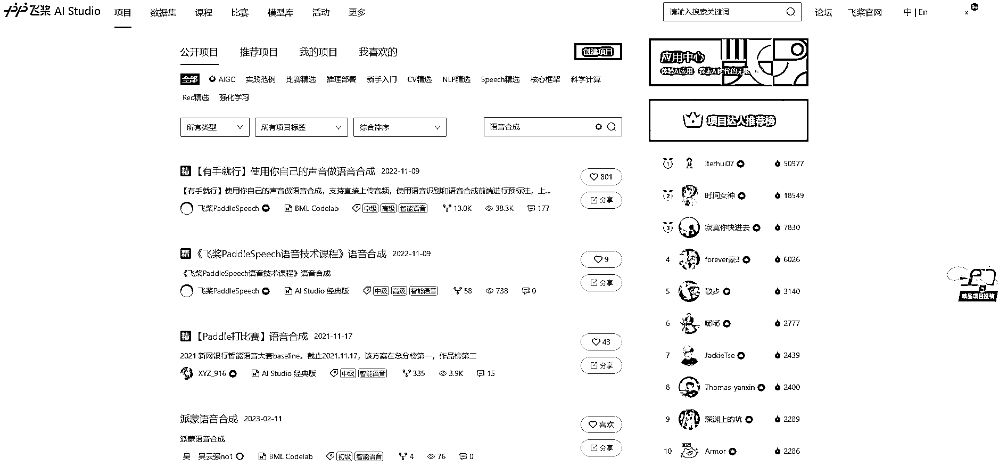

# 百度飞浆平台非常厉害

> 原文：[`www.yuque.com/for_lazy/xkrm14/bfw90ka4ssnklyrf`](https://www.yuque.com/for_lazy/xkrm14/bfw90ka4ssnklyrf)

作者： 感恩学习相信-小陶

日期：2023-03-27

点赞数：23

<ne-hole id="uf2ee31bd" data-lake-id="uf2ee31bd"><ne-card data-card-name="hr" data-card-type="block" id="qaJey" data-event-boundary="card">

正文：

我今天才发现百度飞浆平台非常厉害，但是似乎很少有人提。 就是看到 b 站 up 利用飞浆的开源项目，合成出了自己的声音，于是想搜索一下相关的教程。发现几乎没有。 但是看到一个关于飞浆的宣传片，让我热血沸腾的感觉，原来百度做的事情这么有意义？但是苦于自己不是程序员，不懂怎么使用这个平台。希望生财程序员能出一个使用飞浆平台开源项目的教程。 1.用声音，帮机器看病，用飞浆听机器运转的声音，对千台机器动态情况，了然于心，机器都是独立工作，而且都来自不同的地方，不同的工厂，生产线一旦出现问题，往往很难找到真正的病根，现在通过听机器发出来的噪音，为机器把脉，1 秒就可以诊断不同机器的病情。【我记得曾经在稻盛和夫的书里也听过这样的故事，他能通过听机器的声音知道机器出现问题了。我还记得有人通过 ai 做出宠物叫声的翻译器，是不是现在都可以通过飞浆实现了。】 2.通过飞浆 AI 识别技术，快手获得精准农耕信息，看出 2000 万亩农作物的生长情绪，指导农业生产，打开手机就能看到农作物生长情况，浇水施肥杀虫，看一眼就可以精准安排上。 3.飞浆助力智能巡检机器人，识别设备仪表，准确率 90%以上，人工巡检工作量降低了 90%.之前是全人工巡检，现在都是机器巡检，不仅快，还准。 4.用代码把老师傅 30 年才能练成的配料经验，跑成 3 秒就能给出最优配比的模型。飞浆助力铸造熔炼，每年为企业节省原材料 10%，配料计算时间节省 90% 看到这些科技在企业生产上面的应用，就是有点遗憾自己不太懂代码。也觉得李彦宏其实真的很厉害啊！一直在实实在在的做事。虽然文心一言比不上 chatgpt 厉害。但好歹他做出来属于中国人自己的产品了。 以下是这个宣传片的视频链接，才 300 人看。可能拍的比较意识流吧。一开始没太看懂。主要是离普通人太远了。讲的都是企业使用的解决方案。如果它里面说，可以用这个识别猫咪的情绪，让你知道你家傻猪猫为什么老是围着你喵喵喵的叫，估计就火了。哈哈。 [为什么用百度飞浆哔哩哔哩bilibili](https://www.bilibili.com/video/BV1At4y1N7BU/?spm_id_from=autoNext&vd_source=ce236d25ed4278cb4a00ede72c31e2d1)

<ne-card data-card-name="image" data-card-type="inline" id="M4bLx" data-event-boundary="card">  <ne-hole id="u00ee8790" data-lake-id="u00ee8790"><ne-card data-card-name="hr" data-card-type="block" id="Kzmnt" data-event-boundary="card"><ne-p id="u8961639a" data-lake-id="u8961639a">评论区：

热爱 : 👍🏻

iMairy : 飞浆的官方资料平台教程很全，从小白到大牛从机器学习到人工智能

<ne-hole id="u4c87635d" data-lake-id="u4c87635d"><ne-card data-card-name="hr" data-card-type="block" id="IsDkT" data-event-boundary="card">

公众号懒人找资源，懒人专属群分享

</ne-card></ne-hole></ne-card></ne-hole></ne-card></ne-p></ne-card></ne-hole>