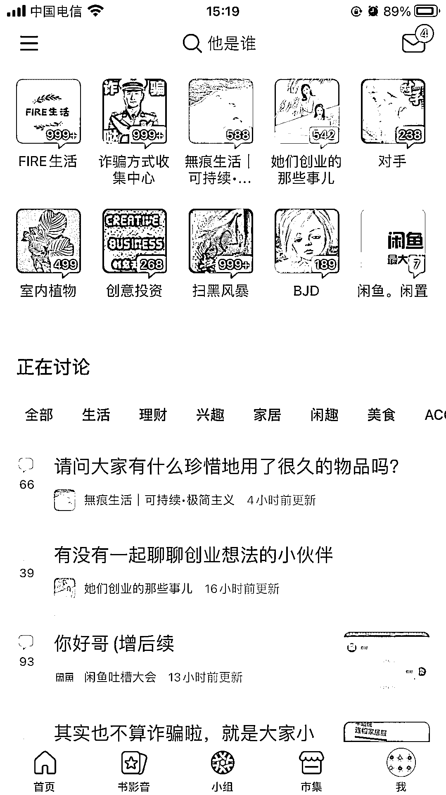

# 小红书没思路缺内容的星友，可以看看这个

> 原文：[`www.yuque.com/for_lazy/xkrm14/dudsps2wpx18cvr6`](https://www.yuque.com/for_lazy/xkrm14/dudsps2wpx18cvr6)

<ne-p id="u4f04d6f4" data-lake-id="u4f04d6f4"><ne-text id="u7a02c63b">作者： 好六</ne-text></ne-p> <ne-p id="u23f1c8dc" data-lake-id="u23f1c8dc"><ne-text id="u1e025c47">日期：2023-03-24</ne-text></ne-p> <ne-p id="u9e0815ed" data-lake-id="u9e0815ed"><ne-text id="ua40b06df">点赞数：</ne-text><ne-text id="u64fb0d0c" ne-bold="true">165</ne-text></ne-p> <ne-hole id="ua77db52e" data-lake-id="ua77db52e"><ne-card data-card-name="hr" data-card-type="block" id="UHkBN" data-event-boundary="card"><ne-p id="u9a74ab4b" data-lake-id="u9a74ab4b"><ne-text id="u05390565">正文：</ne-text></ne-p> <ne-p id="ub8610d30" data-lake-id="ub8610d30"><ne-text id="u2633bbe8">小红书没思路缺内容的星友，可以看看这个了。豆瓣有一个小组功能，每个话题下面会有很多帖子，找互动率高的在小红书发一遍，两个平台的人群画像和年龄都相似，一样的内容爆的概率也不会相差太大。</ne-text></ne-p> <ne-p id="u5bb0f04f" data-lake-id="u5bb0f04f"><ne-card data-card-name="image" data-card-type="inline" id="Lp1Zd" data-event-boundary="card">  <ne-p id="uad61d3d5" data-lake-id="uad61d3d5"><ne-card data-card-name="image" data-card-type="inline" id="lExMy" data-event-boundary="card">  <ne-p id="u59e3a8d6" data-lake-id="u59e3a8d6"><ne-card data-card-name="image" data-card-type="inline" id="NqrKs" data-event-boundary="card">  <ne-hole id="uc56a9844" data-lake-id="uc56a9844"><ne-card data-card-name="hr" data-card-type="block" id="pMcFl" data-event-boundary="card"><ne-p id="u5dce73e4" data-lake-id="u5dce73e4"><ne-text id="u7300edb3">评论区：</ne-text></ne-p> <ne-p id="u73b0571f" data-lake-id="u73b0571f"><ne-text id="u906701e4">暂无评论</ne-text></ne-p> <ne-hole id="u7cdddc01" data-lake-id="u7cdddc01"><ne-card data-card-name="hr" data-card-type="block" id="UuiYi" data-event-boundary="card"><ne-p id="u936d30f2" data-lake-id="u936d30f2"><ne-text id="u4a9bada8">公众号懒人找资源，懒人专属群分享</ne-text></ne-p></ne-card></ne-hole></ne-card></ne-hole></ne-card></ne-p></ne-card></ne-p></ne-card></ne-p></ne-card></ne-hole>