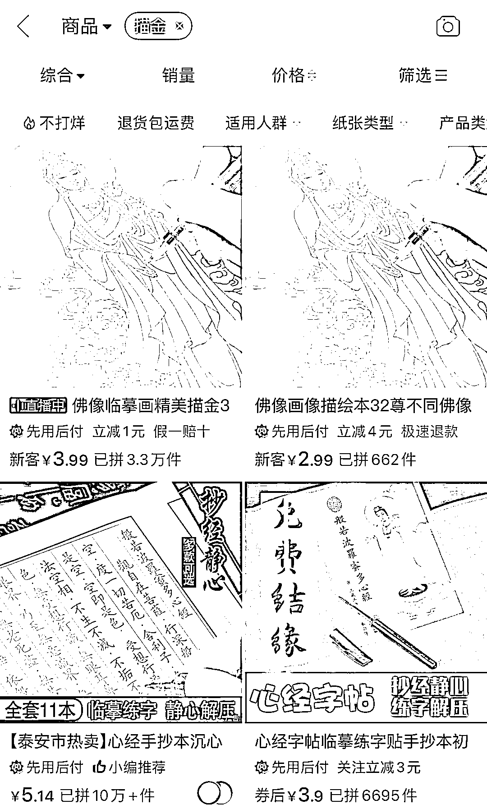

# 拼多多佛经和佛像描金，描完后提供回收和免费供养的服务

> 原文：[`www.yuque.com/for_lazy/xkrm14/gk9k03b35gs7cpmo`](https://www.yuque.com/for_lazy/xkrm14/gk9k03b35gs7cpmo)

作者： 好六

日期：2023-03-24

点赞数：88

<ne-hole id="u7de376a2" data-lake-id="u7de376a2"><ne-card data-card-name="hr" data-card-type="block" id="fwjwL" data-event-boundary="card">

正文：

佛经和佛像描金，描完后提供回收和免费供养的服务，拼多多的店铺销量都不错。签收后店铺会加你微信，再拉你进佛友群，每天在群里分享佛相关的文章，群友活跃度很高，隔一段时间群主会在群里宣传提供供养、祈福、代放生之类的衍生服务，客单价人均千元以上，都跟不是自己的钱一样，很疯狂。

<ne-card data-card-name="image" data-card-type="inline" id="WhWda" data-event-boundary="card">  <ne-hole id="u7924c590" data-lake-id="u7924c590"><ne-card data-card-name="hr" data-card-type="block" id="utRNo" data-event-boundary="card"><ne-p id="u5d216e45" data-lake-id="u5d216e45">评论区：

天启 : 这是个很好的引流项目。

好六 : 哈哈，我感觉这个风向标价值很高，但是点赞数据不好[流汗]

天启 : 什么点赞数据？

好六 : 就是这个风向标的数据

天启 : 昂昂昂

爱米粒 : 这个标我看中标的几率也蛮高的

降落伞 : 这个适合在温州搞 遍地开花的寺庙

西琪💫 : 温州寺庙真的挺多，香火旺盛！

<ne-hole id="u137d83dd" data-lake-id="u137d83dd"><ne-card data-card-name="hr" data-card-type="block" id="QfPFh" data-event-boundary="card">

公众号懒人找资源，懒人专属群分享

</ne-card></ne-hole></ne-card></ne-hole></ne-card></ne-p></ne-card></ne-hole>