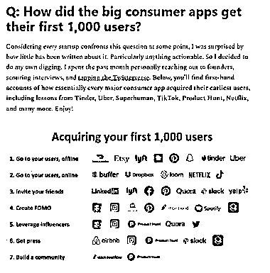

# 国外厉害的 app 如何获得前 1000 名用户

> 原文：[`www.yuque.com/for_lazy/xkrm14/encvuzq75soorl1w`](https://www.yuque.com/for_lazy/xkrm14/encvuzq75soorl1w)

作者： 张云金 _GISer

日期：2023-03-30

点赞数：51

<ne-hole id="u46548994" data-lake-id="u46548994">

正文：

国外的那些牛叉 APP 是如何获得前 1,000 名用户的？ 大家如果想做产品或者卖货，那么如何找到自己的前 1000 名用户呢？ 可以试试文章中提到的一些思路

<ne-hole id="u0fec846e" data-lake-id="u0fec846e">

评论区：

花天卓 : 考虑到每个初创企业在某个时候都会面临这个问题，我对此感到惊讶的是关于这个问题的内容很少，特别是可执行性的内容。因此，我决定自己深入研究。过去一个月，我亲自联系了创始人，搜寻了采访，还利用了 Twitter 的力量。在下面，您将找到几乎所有主要消费应用程序如何获得最早的用户的第一手经验教训，包括来自 Tinder、Uber、Superhuman、TikTok、Product Hunt、Netflix 等公司。享受吧！

萧玄 : 第二个图看不清

张云金 _GISer : 点击查看原图

萧玄 : 感谢[合十]

正宇 : 老张牛 B！

Suzy 溪西 : 这是哪个网站的文章呀，可以发下链接吗

张云金 _GISer : 我不知道发链接是否合适，你先根据标题搜索下吧，搜不到私信我

Suzy 溪西 : 找到了，谢谢[愉快]

<ne-hole id="u5a402ed8" data-lake-id="u5a402ed8">

公众号懒人找资源，懒人专属群分享

</ne-hole></ne-hole></ne-hole>