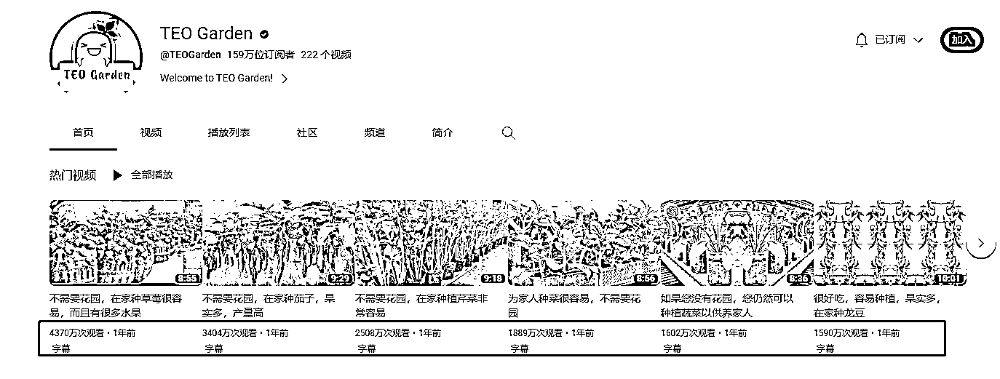
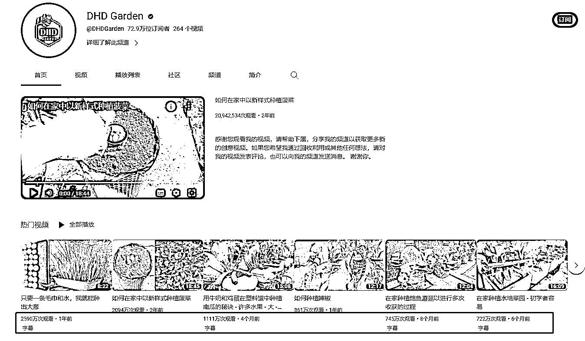

# 油管在家种植的账号，视频播放量都很高

> 原文：[`www.yuque.com/for_lazy/xkrm14/sbwlh0gn2e9omotw`](https://www.yuque.com/for_lazy/xkrm14/sbwlh0gn2e9omotw)

<ne-text id="u1e553671">作者： cpp112358</ne-text>

<ne-text id="u0c2024b4">日期：2023-03-27</ne-text>

<ne-text id="u6ec1ba44">点赞数：</ne-text><ne-text id="u60c5235b" ne-bold="true">56</ne-text>

<ne-hole id="u84c213ff" data-lake-id="u84c213ff"><ne-card data-card-name="hr" data-card-type="block" id="iMtsD" data-event-boundary="card">

<ne-text id="u1c3ae7bd">正文：</ne-text>

<ne-text id="udaa19709">在家种植 油管刷到几个 在家种植的账号，视频播放量都很高。</ne-text> <ne-text id="u69758995">老家农村的，或者在城市里有大露台的可以搞这种视频赚播放收益，顺便还能自己种菜吃[呲牙]</ne-text>[<ne-text id="ubc443637">https://www.youtube.com/@DHDGarden</ne-text>](https://www.youtube.com/@DHDGarden) [<ne-text id="u974dc752">https://www.youtube.com/@TEOGarden</ne-text>](https://www.youtube.com/@TEOGarden)

<ne-card data-card-name="image" data-card-type="inline" id="mIfZf" data-event-boundary="card"></ne-card>

<ne-card data-card-name="image" data-card-type="inline" id="ubtnw" data-event-boundary="card">  <ne-hole id="u36ed06dd" data-lake-id="u36ed06dd"><ne-card data-card-name="hr" data-card-type="block" id="wUvRe" data-event-boundary="card"><ne-p id="u4b6f3970" data-lake-id="u4b6f3970"><ne-text id="ua83c7a39">评论区：</ne-text>

<ne-text id="u972d64d2">Luke 王子 : 视频号适合这些</ne-text>

<ne-text id="u868e2218">along : 看了一下，播放量还挺高的。几百万</ne-text>

<ne-hole id="ub857834b" data-lake-id="ub857834b"><ne-card data-card-name="hr" data-card-type="block" id="SDcb8" data-event-boundary="card">

<ne-text id="ubbcbe6d1">公众号懒人找资源，懒人专属群分享</ne-text>

</ne-card></ne-hole></ne-card></ne-hole></ne-card></ne-p></ne-card></ne-hole>