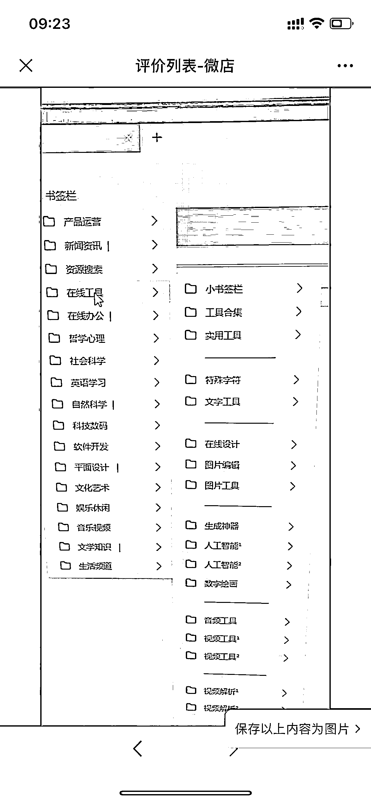

# 将 5000 个网址整理后导出书签，售卖

> 原文：[`www.yuque.com/for_lazy/xkrm14/me3uux6ygd89ph38`](https://www.yuque.com/for_lazy/xkrm14/me3uux6ygd89ph38)

作者： 沐文

日期：2023-03-31

点赞数：70

<ne-hole id="u07d24348" data-lake-id="u07d24348"><ne-card data-card-name="hr" data-card-type="block" id="tsbtn" data-event-boundary="card">

正文：

万物皆可变现，举个案例：5000 个网址的书签栏 将不同的网站进行分类整理，大部分都是互联网常用的网站，还有一些小工具的合集 整理之后，将书签导出，进行售卖 一份 99 元 类似这样的资源整理，边际成本低，同时也是一门很好的小生意！

<ne-card data-card-name="image" data-card-type="inline" id="vgAAM" data-event-boundary="card"></ne-card>

<ne-card data-card-name="image" data-card-type="inline" id="Hf6rF" data-event-boundary="card"></ne-card>

<ne-card data-card-name="image" data-card-type="inline" id="LYgXC" data-event-boundary="card"></ne-card>

<ne-hole id="udc88ecde" data-lake-id="udc88ecde"><ne-card data-card-name="hr" data-card-type="block" id="oMXon" data-event-boundary="card">

评论区：

池月白 : 看了一眼闲鱼上 9 块 9，太绝了[呲牙]

Luke 王子 : 懒人经济

姬小光 : 相当于卖个导航站

沐文 : 我花了 99，然后加了这位小哥，然后想办法转化进来生财~谁赚了

正宇 : 哈哈哈

池月白 : 还得是沐文大佬来[偷笑]

<ne-hole id="u8885cd38" data-lake-id="u8885cd38"><ne-card data-card-name="hr" data-card-type="block" id="Q00zZ" data-event-boundary="card">

公众号懒人找资源，懒人专属群分享

</ne-card></ne-hole></ne-card></ne-hole></ne-card></ne-hole>