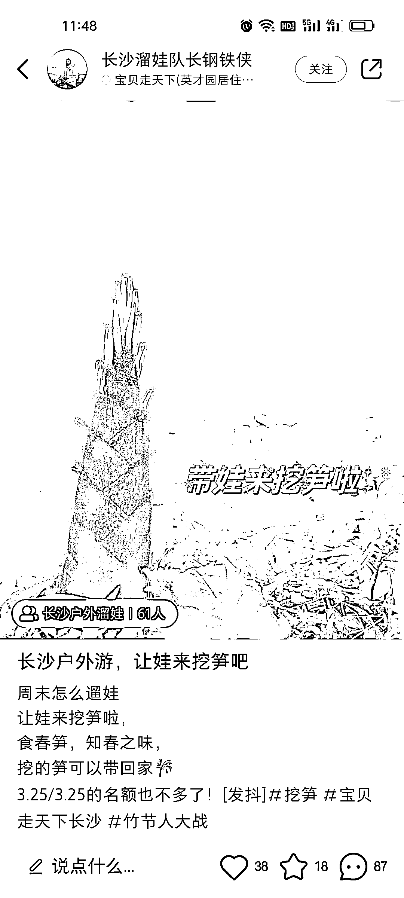
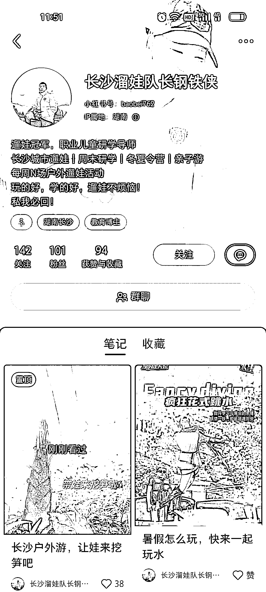

# 户外遛娃 解决城市父母遛娃的痛点

> 原文：[`www.yuque.com/for_lazy/xkrm14/mhtwupmcbp379ud5`](https://www.yuque.com/for_lazy/xkrm14/mhtwupmcbp379ud5)

作者： 可伊

日期：2023-03-31

点赞数：40

<ne-hole id="u940d0a03" data-lake-id="u940d0a03">

正文：

户外遛娃 解决城市父母遛娃的痛点 1、一方面现在户外活动活，认可的人高，户外遛娃这个细分产品赛道很不错，相对于成人赛道来是蓝海 2、小红书低粉精准引流 号主粉丝只有 101 ，这篇最多赞的图文，赞 38 收藏 18 评论 87 都是要参与的精准粉丝，而且效果好复购率也很高

<ne-hole id="u7ea07cf0" data-lake-id="u7ea07cf0">

评论区：

莫莉有魔力 : 二月份的时候，我还加入了很多他们的户外活动微信群。前两年我就是在小红书上到处找这种活动圈子发现没有。但是今年初突然就爆发了，好多宝妈遛娃活动群，城市青年社交户外活动群等。跟疫情放开很大的关系，憋坏了。

可伊 : 哈哈哈确实，都想出来透气哒

安慕希姓安（千校大学* : 夺笋啊😱[得意]

<ne-hole id="ude24d0f2" data-lake-id="ude24d0f2">

公众号懒人找资源，懒人专属群分享

</ne-hole></ne-hole></ne-hole>