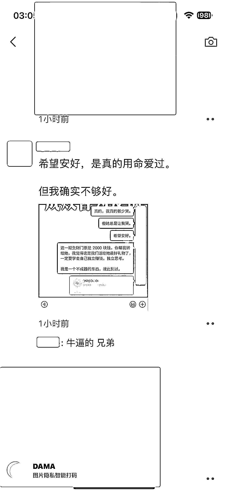

# 将分手礼物赋予意义

> 原文：[`www.yuque.com/for_lazy/xkrm14/zvmv6olpxh89atsq`](https://www.yuque.com/for_lazy/xkrm14/zvmv6olpxh89atsq)

<ne-p id="ude8fdb50" data-lake-id="ude8fdb50"><ne-text id="u1319f008">作者： 米杰</ne-text></ne-p> <ne-p id="ucb3ef6b8" data-lake-id="ucb3ef6b8"><ne-text id="u484380ff">日期：2023-03-30</ne-text></ne-p> <ne-p id="u8c723d36" data-lake-id="u8c723d36"><ne-text id="u2ebbb7d9">点赞数：</ne-text><ne-text id="ua8ee8ab2" ne-bold="true">107</ne-text></ne-p> <ne-hole id="uef487cb1" data-lake-id="uef487cb1"><ne-card data-card-name="hr" data-card-type="block" id="yiasH" data-event-boundary="card"><ne-p id="u92ea8780" data-lake-id="u92ea8780"><ne-text id="ud92df1d6">正文：</ne-text></ne-p> <ne-p id="u9d66ebc2" data-lake-id="u9d66ebc2"><ne-text id="uca9327c1">赋有意义的分手礼物！ 这位圈友，在和心爱多年的女朋友分手那一刻做了一件让人热泪盈眶的事情。</ne-text> <ne-text id="uad9ffccc">面对那个曾伤透了他的心的女孩，他选择用“最新一期生财门票”作为最后的告别礼物，希望她能够成为一名的“生财圈友”。 拥有“独立赚钱”“独立思考”的能力。</ne-text> <ne-text id="u25e4e387">爱一个人最伟大的方式，是让他在面对风雨中依旧能够独立成长。就像父母的爱一样，让孩子拥有独立的社会实践能力，也许是父母对孩子的另外一种保护吧！</ne-text> <ne-text id="ufc3a6408">（发布内容已征得圈友本人同意）</ne-text></ne-p> <ne-p id="u5a3a6058" data-lake-id="u5a3a6058"><ne-card data-card-name="image" data-card-type="inline" id="S4Lno" data-event-boundary="card"></ne-card></ne-p> <ne-p id="u753535c7" data-lake-id="u753535c7"><ne-card data-card-name="image" data-card-type="inline" id="XsaRs" data-event-boundary="card"></ne-card></ne-p> <ne-hole id="ued0ae613" data-lake-id="ued0ae613"><ne-card data-card-name="hr" data-card-type="block" id="b01BE" data-event-boundary="card"><ne-p id="ud4009e34" data-lake-id="ud4009e34"><ne-text id="ufc7ef1d0">评论区：</ne-text></ne-p> <ne-p id="uaa345e78" data-lake-id="uaa345e78"><ne-text id="u9393fdbb">老彭 : Dama 是什么，小程序吗，还是 app</ne-text></ne-p> <ne-p id="ub8a06b55" data-lake-id="ub8a06b55"><ne-text id="u3637726b">三笙 : 如果不是真的，我以为是软文，哈哈</ne-text></ne-p> <ne-p id="u5f1e8a6e" data-lake-id="u5f1e8a6e"><ne-text id="u7e0147e3">米杰 : app</ne-text></ne-p> <ne-p id="u8c8a5324" data-lake-id="u8c8a5324"><ne-text id="u153133f5">无匠心，不设计 : 这……</ne-text></ne-p> <ne-p id="ue3004e28" data-lake-id="ue3004e28"><ne-text id="ue62ce0bf">瓜藤 : 潇洒</ne-text></ne-p> <ne-p id="u37624286" data-lake-id="u37624286"><ne-text id="u5751736c">渔夫 : 牛逼</ne-text></ne-p> <ne-p id="u320e2d18" data-lake-id="u320e2d18"><ne-text id="u5410b9b9">米杰 : 其实，最开始我很想安慰一下这个圈友。但是，我发现他太理性了，我欲言又止[皱眉][皱眉][皱眉]</ne-text></ne-p> <ne-p id="u70b73f5a" data-lake-id="u70b73f5a"><ne-text id="uc58448ce">米杰 : 艺术源于生活</ne-text></ne-p> <ne-hole id="uaf8ec613" data-lake-id="uaf8ec613"><ne-card data-card-name="hr" data-card-type="block" id="PVBeH" data-event-boundary="card"><ne-p id="u968bc4e4" data-lake-id="u968bc4e4"><ne-text id="u3b333563">公众号懒人找资源，懒人专属群分享</ne-text></ne-p></ne-card></ne-hole></ne-card></ne-hole></ne-card></ne-hole>