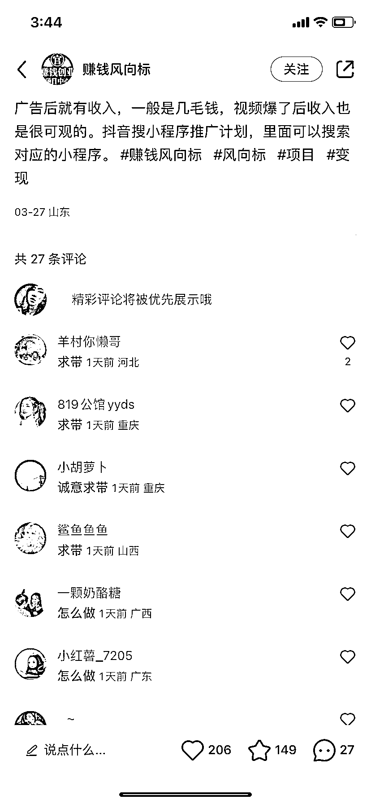
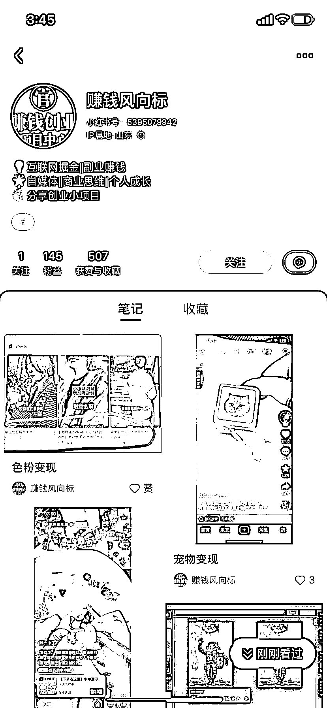

# 民间故事+小程序推广及课程

> 原文：[`www.yuque.com/for_lazy/xkrm14/msu57g79x322kpb2`](https://www.yuque.com/for_lazy/xkrm14/msu57g79x322kpb2)

作者： 我安了个安安

日期：2023-03-29

点赞数：35

<ne-hole id="ue1805c77" data-lake-id="ue1805c77"><ne-card data-card-name="hr" data-card-type="block" id="oegap" data-event-boundary="card">

正文：

这个风向标有两个方向： 1、正如图中所说的，用民间故事+小程序推广的模式来赚钱，同时可以用这个形式教人授课赚钱 2、利用风向标的信息差做垂直 IP，然后找相关领域先入局的圈友做课程带入或者帮他引流下游来变现是不错的模式，相当于借势分销

<ne-card data-card-name="image" data-card-type="inline" id="JHzBi" data-event-boundary="card">  <ne-p id="u3857ab29" data-lake-id="u3857ab29"><ne-card data-card-name="image" data-card-type="inline" id="Fegop" data-event-boundary="card">  <ne-p id="u16f5ec48" data-lake-id="u16f5ec48"><ne-card data-card-name="image" data-card-type="inline" id="Mxnj4" data-event-boundary="card">  <ne-p id="ub9e89294" data-lake-id="ub9e89294"><ne-card data-card-name="image" data-card-type="inline" id="xYJC7" data-event-boundary="card">  <ne-hole id="u094d254e" data-lake-id="u094d254e"><ne-card data-card-name="hr" data-card-type="block" id="G4cgI" data-event-boundary="card"><ne-p id="u06db168e" data-lake-id="u06db168e">评论区：

<ne-hole id="u8dfb25e5" data-lake-id="u8dfb25e5"><ne-card data-card-name="hr" data-card-type="block" id="SU5UC" data-event-boundary="card">

公众号懒人找资源，懒人专属群分享

</ne-card></ne-hole></ne-card></ne-hole></ne-card></ne-p></ne-card></ne-p></ne-card></ne-p></ne-card></ne-p></ne-card></ne-hole>