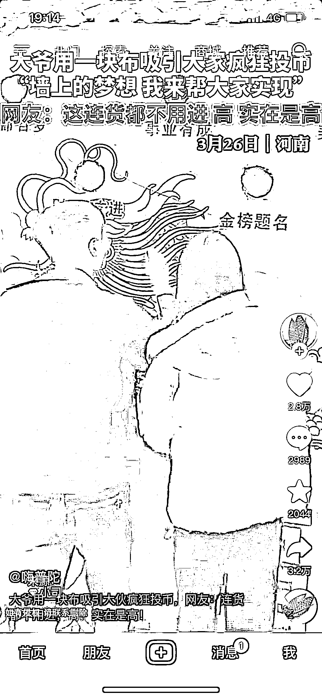

# 景点投币祈福应该会火

> 原文：[`www.yuque.com/for_lazy/xkrm14/ilg6mz61z3wq3xbv`](https://www.yuque.com/for_lazy/xkrm14/ilg6mz61z3wq3xbv)

作者： 蝈蝈、

日期：2023-03-28

点赞数：46

<ne-hole id="ub37d12db" data-lake-id="ub37d12db"><ne-card data-card-name="hr" data-card-type="block" id="KYezU" data-event-boundary="card">

正文：

这个绝了，到了一些景点有投币祈福的我都会玩。10 元 20 个祈福币，20 元 50 个，稍微有点贵我觉得我，场再搭好一点，价格体系再合理一点，应该会火

<ne-card data-card-name="image" data-card-type="inline" id="DOOBK" data-event-boundary="card">  <ne-hole id="u69c98b71" data-lake-id="u69c98b71"><ne-card data-card-name="hr" data-card-type="block" id="PNPn8" data-event-boundary="card"><ne-p id="uf94bcc42" data-lake-id="uf94bcc42">评论区：

安哥拉 : 这个真是绝了

兰心 : 我去旁边的寺庙也搞一块，云祈福[呲牙]

<ne-hole id="u47052363" data-lake-id="u47052363"><ne-card data-card-name="hr" data-card-type="block" id="Z2OG3" data-event-boundary="card">

公众号懒人找资源，懒人专属群分享

</ne-card></ne-hole></ne-card></ne-hole></ne-card></ne-p></ne-card></ne-hole>