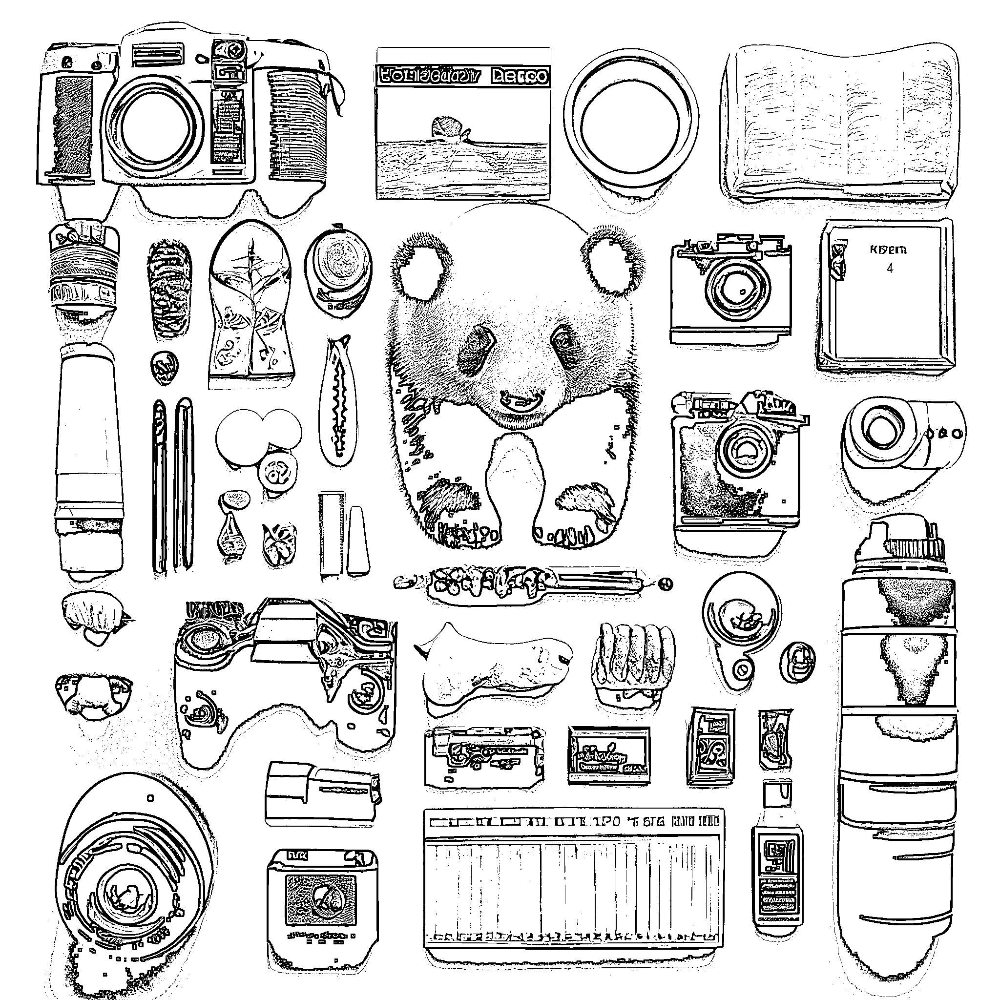
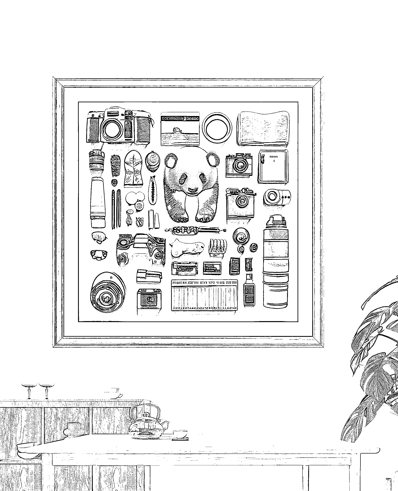

# 普通人利用 AI 赚钱的方式之一，相框

> 原文：[`www.yuque.com/for_lazy/xkrm14/ru9249r97gzs0wbf`](https://www.yuque.com/for_lazy/xkrm14/ru9249r97gzs0wbf)

作者： 甜瓜

日期：2023-03-28

点赞数：49

正文：

最近跑通的普通人利用 AI 赚钱的方式之一，相框。 即，用 AI 生成精美的图片，再加上相框，然后各平台发布短视频/图文，引流微信，转化成交。 下图是最近比较受欢迎的订单风格。 当然，还有很多方向适合普通人尝试。制作潮玩形象、制作装逼猎奇的照片、AI 形象口播账号，等等 最重要是，动起来

  

  

  

  

  

  

评论区：

一只想飞的猪 : 请问这种是怎么打印出来的这种效果？

Lautitia : midjourney

情感指导（同城相亲） : Ai 形象口播要怎么做呢

公众号懒人找资源，懒人专属群分享

</ne-p></ne-p></ne-p></ne-p></ne-p></ne-p>