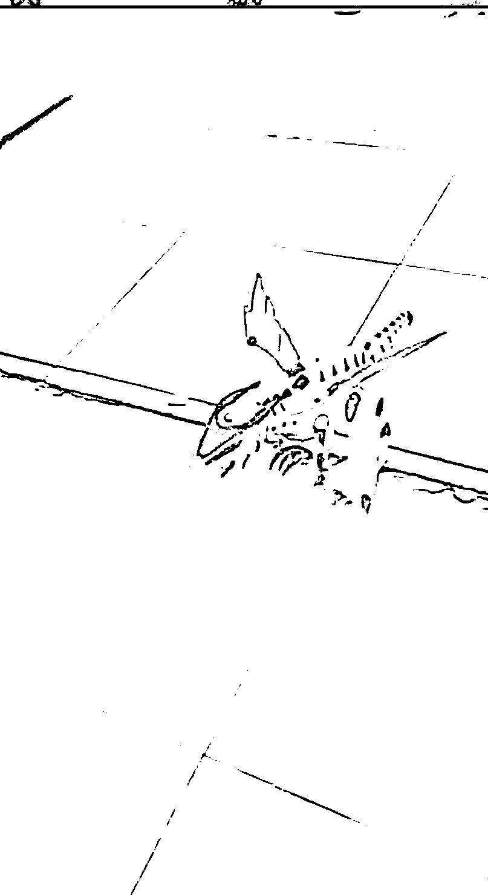
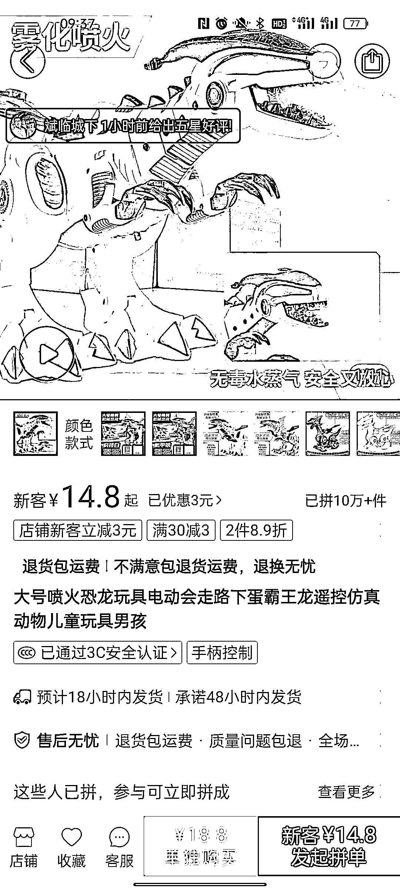

# 拼多多会喷火的恐龙玩具销量好，可复制到海外

> 原文：[`www.yuque.com/for_lazy/xkrm14/ieokcnbxu1melf0m`](https://www.yuque.com/for_lazy/xkrm14/ieokcnbxu1melf0m)

作者： 麦兜不是猪

日期：2023-03-28

点赞数：34

正文：

看到一个会喷火的遥控恐龙玩具视频，感觉太有创意了，小朋友们一定会喜欢。并且视频的展示效果给我的震撼比商品详情页要大，一下子突出了产品卖点。 p 多多上看了一下好几个是 10 万+了，价格差不贵可，才十几块钱。 这种商品一定有很多人不知道，甚至可以卖到海外去。

  <ne-p id="u8c95ce19" data-lake-id="u8c95ce19">  <ne-p id="u74a5e88c" data-lake-id="u74a5e88c">  <ne-p id="u5fb5aa30" data-lake-id="u5fb5aa30">  <ne-p id="u4f9e5af2" data-lake-id="u4f9e5af2">评论区：

兰心 : 前年在玩具展看到过

麦兜不是猪 : 这么早～

公众号懒人找资源，懒人专属群分享

</ne-p></ne-p></ne-p></ne-p>