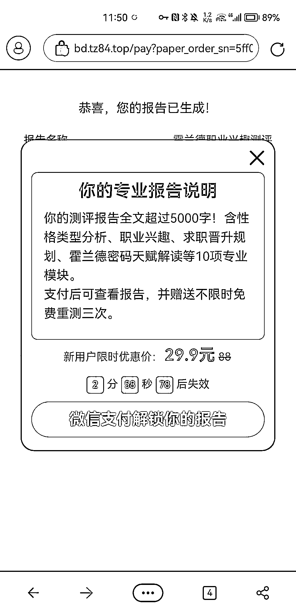
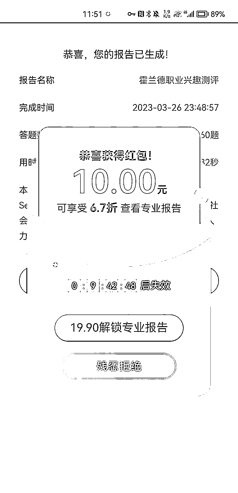
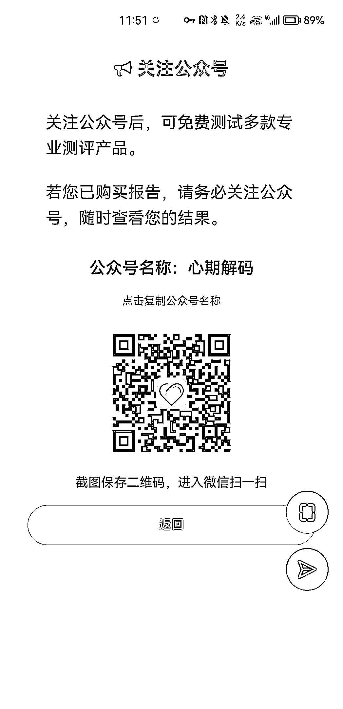
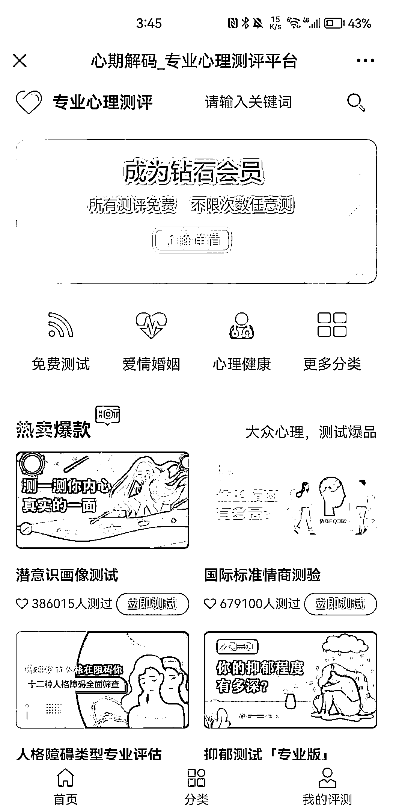

# 个人测试类产品投放拆解

> 原文：[`www.yuque.com/for_lazy/xkrm14/tgzi2bdpvfd6ki4y`](https://www.yuque.com/for_lazy/xkrm14/tgzi2bdpvfd6ki4y)

作者： 王永超

日期：2023-03-27

点赞数：17

<ne-hole id="u338c6d11" data-lake-id="u338c6d11"><ne-card data-card-name="hr" data-card-type="block" id="ppkhZ" data-event-boundary="card">

正文：

搜了个个人测试的产品，然后发现里面的套路 进去之后，完成测试，然后付费 29.9，拿到结果， 点击关闭，换成 19.9，拿结果 再点击关闭，又成了 9.9，拿结果 最后变成了关注公众号 非常典型的，只要你进来，我就尽量从你身上拔下来点什么，最不济，进个公众号，后面慢慢来， 不仅仅是因为广告是付费的，他们尽量抓钱抓人，肯 29.9 买的人，不会知道 9.9 还能买到。 通过不断降价，以及时间限制，满额红包，等字眼来吸引用户付费 并且这还不是他们的主要盈利，因为这个价格根本不足以支撑广告费的投放。 看第六张图，进到公众号里面才发现各种不一样的测试，大量的回购，并且里面还有免费的，需要转发， 复购，裂变 从上面的时间限制，不断降价，满额红包， 到后面的，低价测试成瘾，裂变，再往后应该还有变现渠道，不过没有深挖了 感兴趣的可以去搜一下，挖一下

<ne-card data-card-name="image" data-card-type="inline" id="pLwJr" data-event-boundary="card">  <ne-p id="uf2233758" data-lake-id="uf2233758"><ne-card data-card-name="image" data-card-type="inline" id="RAU9Q" data-event-boundary="card">  <ne-p id="u5650c095" data-lake-id="u5650c095"><ne-card data-card-name="image" data-card-type="inline" id="B4a4g" data-event-boundary="card">  <ne-p id="uf9bbd91c" data-lake-id="uf9bbd91c"><ne-card data-card-name="image" data-card-type="inline" id="M2nHa" data-event-boundary="card">  <ne-p id="ufc136013" data-lake-id="ufc136013"><ne-card data-card-name="image" data-card-type="inline" id="vsC6n" data-event-boundary="card">  <ne-p id="u04e22f94" data-lake-id="u04e22f94"><ne-card data-card-name="image" data-card-type="inline" id="T3Uxa" data-event-boundary="card">  <ne-hole id="ua8dd8fd8" data-lake-id="ua8dd8fd8"><ne-card data-card-name="hr" data-card-type="block" id="W4Qdp" data-event-boundary="card"><ne-p id="ucb5ee504" data-lake-id="ucb5ee504">评论区：

暂无评论

<ne-hole id="ue86304f7" data-lake-id="ue86304f7"><ne-card data-card-name="hr" data-card-type="block" id="guw1S" data-event-boundary="card">

公众号懒人找资源，懒人专属群分享

</ne-card></ne-hole></ne-card></ne-hole></ne-card></ne-p></ne-card></ne-p></ne-card></ne-p></ne-card></ne-p></ne-card></ne-p></ne-card></ne-p></ne-card></ne-hole>