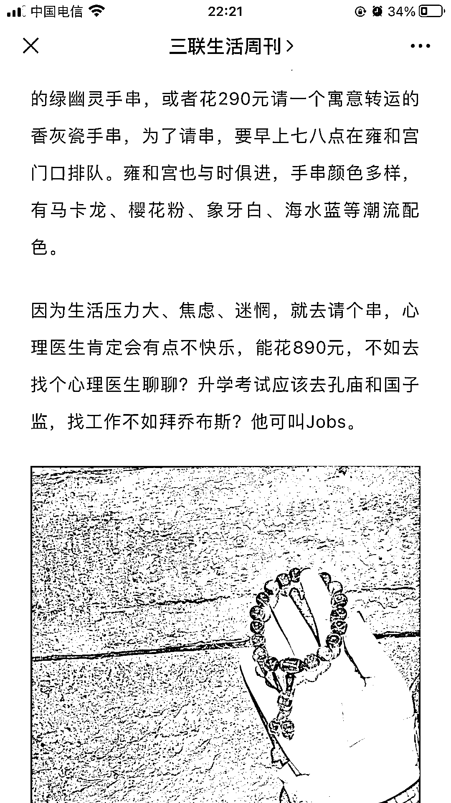

# 思路：很多年轻职场人比较焦虑，偏好购买这种手串、水晶球、符咒之类的东西来换取心理安慰

> 原文：[`www.yuque.com/for_lazy/xkrm14/dbcnmp1wdtnpr9i6`](https://www.yuque.com/for_lazy/xkrm14/dbcnmp1wdtnpr9i6)

作者： 好六

日期：2023-03-24

点赞数：86

<ne-hole id="u785d882c" data-lake-id="u785d882c"><ne-card data-card-name="hr" data-card-type="block" id="VkAut" data-event-boundary="card">

正文：

就业环境不好，很多年轻职场人比较焦虑，偏好购买这种手串、水晶球、符咒之类的东西，来换取心理安慰。扩展一下产品思维和受众人群，针对学生、考研人群，是不是也可以卖升学手串、文昌塔、蝉（一鸣惊人）之类的产品，小红书引流，拼多多进货，利润翻 8 倍。

<ne-card data-card-name="image" data-card-type="inline" id="cbFOi" data-event-boundary="card"></ne-card>

<ne-card data-card-name="image" data-card-type="inline" id="kVr9L" data-event-boundary="card"></ne-card>

<ne-card data-card-name="image" data-card-type="inline" id="WKUh9" data-event-boundary="card"></ne-card>

<ne-hole id="uecf87282" data-lake-id="uecf87282"><ne-card data-card-name="hr" data-card-type="block" id="SBimU" data-event-boundary="card">

评论区：

天启 : 符咒类特好卖。

金九渊 : 小红书能直接卖符咒？

天启 : 我没说直接卖啊。你不会先引流啊

寒歆 : 我小红书店铺就是卖这种水晶手链的，一条利润 100+

好六 : 牛啊你

金九渊 : 厉害

贝影 : 自己发货还是拼多多发货啊，现在拼多多控制无货源后经常封号

巧巧 : 厉害了，可以交流吗

<ne-hole id="u8a544cfb" data-lake-id="u8a544cfb"><ne-card data-card-name="hr" data-card-type="block" id="d9cCx" data-event-boundary="card">

公众号懒人找资源，懒人专属群分享

</ne-card></ne-hole></ne-card></ne-hole></ne-card></ne-hole>