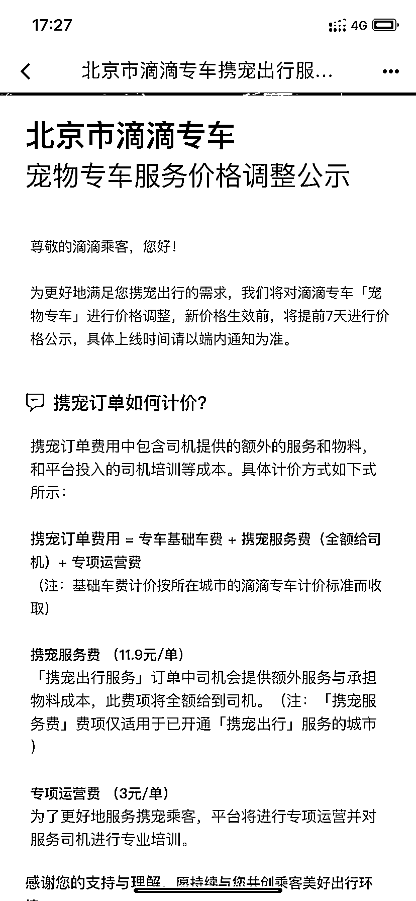

# 滴滴推出宠物专车,随着人口老龄化的加剧宠物市场很有可能迎来爆发期

> 原文：[`www.yuque.com/for_lazy/xkrm14/yev2mhvpg0vee5pn`](https://www.yuque.com/for_lazy/xkrm14/yev2mhvpg0vee5pn)

作者： 太波

日期：2023-03-24

点赞数：36

<ne-hole id="uff4a202e" data-lake-id="uff4a202e"><ne-card data-card-name="hr" data-card-type="block" id="zYbTD" data-event-boundary="card">

正文：

滴滴推出宠物专车，围绕宠物的衣食住行，现在宠物的行，终于有了突破，以后随着人口老龄化的加剧宠物市场很有可能迎来爆发期，宠物出行是未来的刚需，目前滴滴宠物专车还是必须有主人陪同，

<ne-card data-card-name="image" data-card-type="inline" id="yHBME" data-event-boundary="card"></ne-card>

<ne-hole id="u14dd6184" data-lake-id="u14dd6184"><ne-card data-card-name="hr" data-card-type="block" id="gseaK" data-event-boundary="card">

评论区：

阿黎 : 小红书上，很多人晒，让宠物自己坐车去洗澡

太波 : 我是才刷到，看来这个业务是真的火

蛋蛋。 : 宠物行业也是一个金库哎

lili : 那跑腿可以带宠物洗澡吗

太波 : 是啊，以后这个行业会更好

太波 : 有需求就有生意

Luke 王子 : 深入挖掘了需求

<ne-hole id="ufdc409b5" data-lake-id="ufdc409b5"><ne-card data-card-name="hr" data-card-type="block" id="wfD6A" data-event-boundary="card">

公众号懒人找资源，懒人专属群分享

</ne-card></ne-hole></ne-card></ne-hole></ne-card></ne-hole>