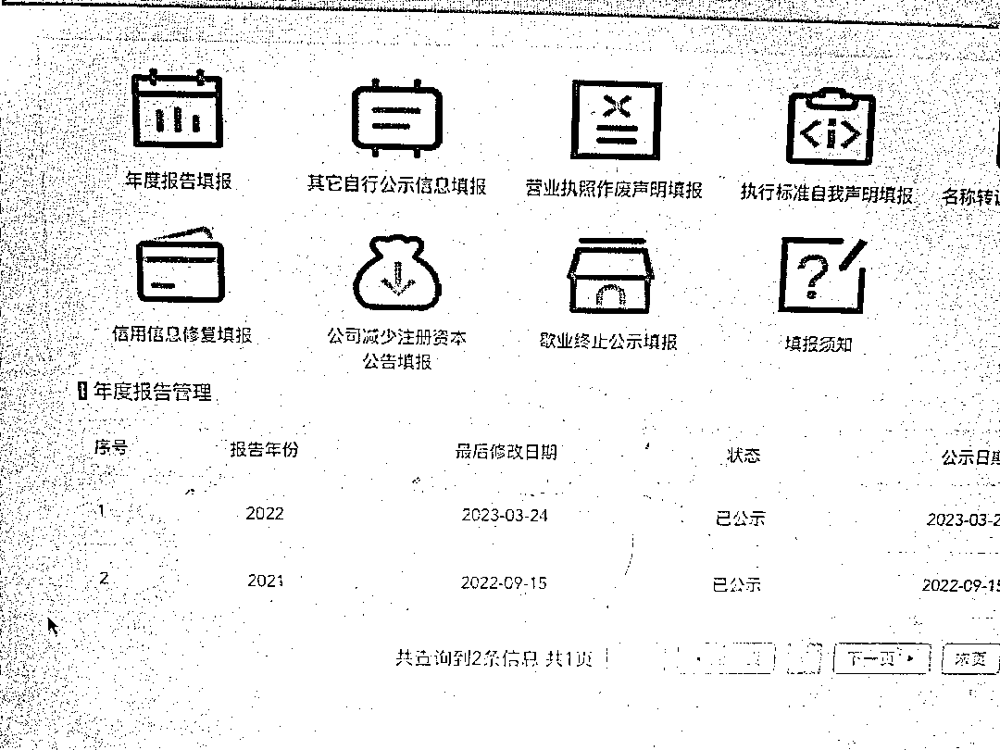

# 营业执照年报一个省钱、赚钱方法分享

> 原文：[`www.yuque.com/for_lazy/xkrm14/yz7i5g2tmgvu79w2`](https://www.yuque.com/for_lazy/xkrm14/yz7i5g2tmgvu79w2)

作者： 北纬 64 度

日期：2023-03-24

点赞数：49

<ne-hole id="ub9a5f846" data-lake-id="ub9a5f846">

正文：

关于执照年报一个省钱，一个赚钱方法 最近有企业营业执照的又到了每年一度的提交年报了，个体户营业执照无论有没有使用有没有盈利都需要提交个年报公示 看上去第一次很难，其实我们是可以自己操作的 （无意间晓得朋友做副业办的个体户执照每年花了 1 百元让当时办理执照的商家代提交个） 图 1 是商家代办项目，会有人发短信 图 2 是如何自己提交年报公示（只展示了如何登录，后面登录进去后填写个人信息就行，在年度报告填报里）

  <ne-p id="u536b098d" data-lake-id="u536b098d">  <ne-p id="u630d2e62" data-lake-id="u630d2e62">  <ne-hole id="ud07290bd" data-lake-id="ud07290bd"><ne-p id="u11ac7761" data-lake-id="u11ac7761">评论区：

詹伟平 : 还能让工商的人帮你线上代填

北纬 64 度 : 确实，服务态度好好，第一次时候还教我怎么用营业执照登陆等等

认知本质 : 工商的人怎么联系？

詹伟平 : 他们会打你电话

🌸🌸🌸 : 不会做的，可以问我，之前在代理记账公司，做过很多

<ne-hole id="u15d875a1" data-lake-id="u15d875a1">

公众号懒人找资源，懒人专属群分享

</ne-hole></ne-hole></ne-p></ne-p></ne-p></ne-hole>