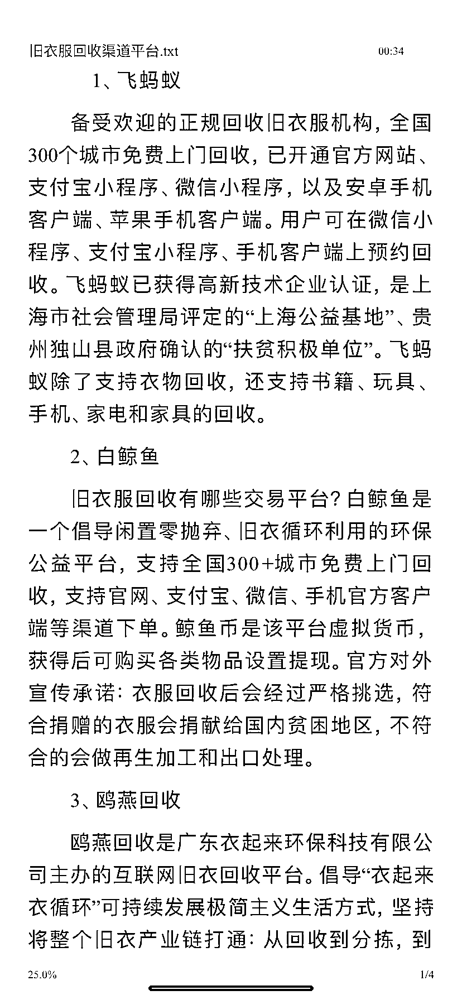
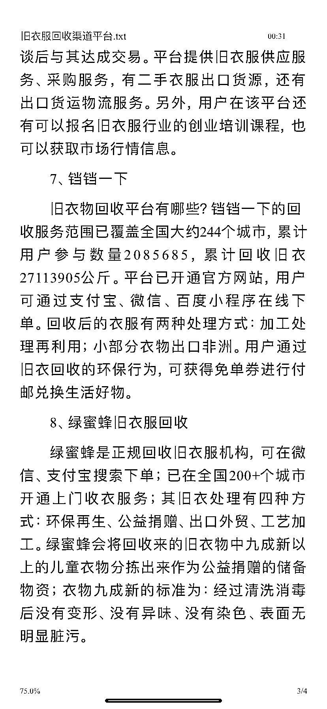
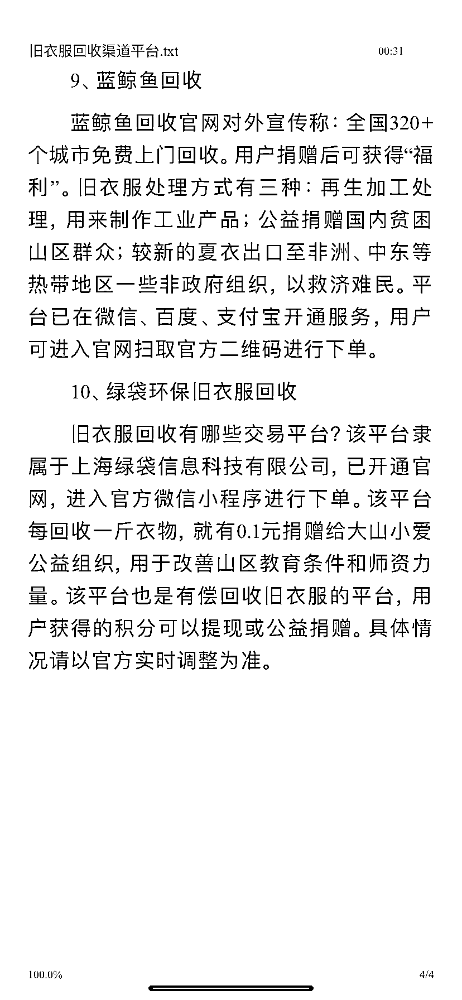

# 旧衣回收项目有很大的市场

> 原文：[`www.yuque.com/for_lazy/xkrm14/tn490ganelo0tp3h`](https://www.yuque.com/for_lazy/xkrm14/tn490ganelo0tp3h)

作者： 西哥

日期：2023-03-24

点赞数：38

正文：

和大家分享一个最近看到的项目旧衣回收♻️ 旧衣服回收在我国有很大的市场，只不过有时候大家都选择性忽略了它。这个旧衣服回收怎么干？ 每个人都可以干，基本上没啥门槛，和其他的废品行业一样。 1.与小区废品回收中心的人合作，让他们帮忙代收，给他们提供分成就行了。 2.与家政服务合作.可以与家政合作，他们为业主上门打扫卫生的同时，可以赠送衣柜整理业务， 服务费可以从旧衣服回收费用里面扣取，这样就会多出很多货源。 3.跟业主约定时间，上门回收。 4.可以在 58 同城或者在百度上打广告，加入每家每克，采用互联网回收模式， 一键下单，前往客户家里上门回收，做到精准回收、高效回收。 附上几个平台回收渠道，有兴趣的朋友可以研究看看

评论区：

城市隐者 : 一直好奇旧衣服最终流向哪里？谁会买？

西哥 : 基本都是卖到非洲

抖 sir : 基本都流向了非洲

詹伟平 : 论吨卖

… : 需要当当一下的 可以 call 我

aliu : 收来后，有公司收吗？

牧羊人 : 收回来怎么变现呢？

蛋蛋。 : 看那些旧衣回收的柜子都被收垃圾的阿姨打开了

公众号懒人找资源，懒人专属群分享

