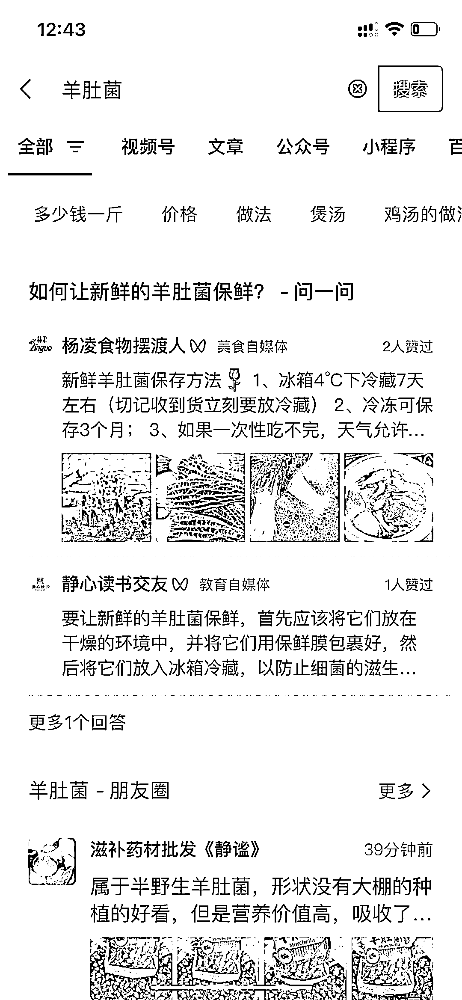

# 微信问一问，提前布局回答

> 原文：[`www.yuque.com/for_lazy/xkrm14/yrhlgbeigddsr459`](https://www.yuque.com/for_lazy/xkrm14/yrhlgbeigddsr459)

<ne-p id="uc0ecec06" data-lake-id="uc0ecec06"><ne-text id="ude6e5ec4">作者： 韵韵</ne-text></ne-p> <ne-p id="u6b3f023d" data-lake-id="u6b3f023d"><ne-text id="u409eabd5">日期：2023-03-31</ne-text></ne-p> <ne-p id="uf0c19e03" data-lake-id="uf0c19e03"><ne-text id="u527828b1">点赞数：</ne-text><ne-text id="u31fb65b1" ne-bold="true">58</ne-text></ne-p> <ne-hole id="u87a0bf53" data-lake-id="u87a0bf53"><ne-card data-card-name="hr" data-card-type="block" id="qrTaf" data-event-boundary="card"><ne-p id="u42fe4717" data-lake-id="u42fe4717"><ne-text id="u1990387b">正文：</ne-text></ne-p> <ne-p id="u4ed280b9" data-lake-id="u4ed280b9"><ne-text id="u741f2b38">在微信上搜索，「问一问」的入口出现了，我刚刚搜了「羊肚菌」一次，才 3 个回答，目测可以开始布局了？有点像知乎问答~</ne-text></ne-p> <ne-p id="u134b845c" data-lake-id="u134b845c"><ne-card data-card-name="image" data-card-type="inline" id="zE9sR" data-event-boundary="card"></ne-card></ne-p> <ne-p id="ucca807c8" data-lake-id="ucca807c8"><ne-card data-card-name="image" data-card-type="inline" id="VRw1x" data-event-boundary="card"></ne-card></ne-p> <ne-hole id="u4182f8ab" data-lake-id="u4182f8ab"><ne-card data-card-name="hr" data-card-type="block" id="l6uMC" data-event-boundary="card"><ne-p id="udbc8448e" data-lake-id="udbc8448e"><ne-text id="u0da09cdd">评论区：</ne-text></ne-p> <ne-p id="u84700f0a" data-lake-id="u84700f0a"><ne-text id="u84e5f6d8">暂无评论</ne-text></ne-p> <ne-hole id="ub74114b2" data-lake-id="ub74114b2"><ne-card data-card-name="hr" data-card-type="block" id="wPncu" data-event-boundary="card"><ne-p id="u66480636" data-lake-id="u66480636"><ne-text id="u9b1c33e2">公众号懒人找资源，懒人专属群分享</ne-text></ne-p></ne-card></ne-hole></ne-card></ne-hole></ne-card></ne-hole>