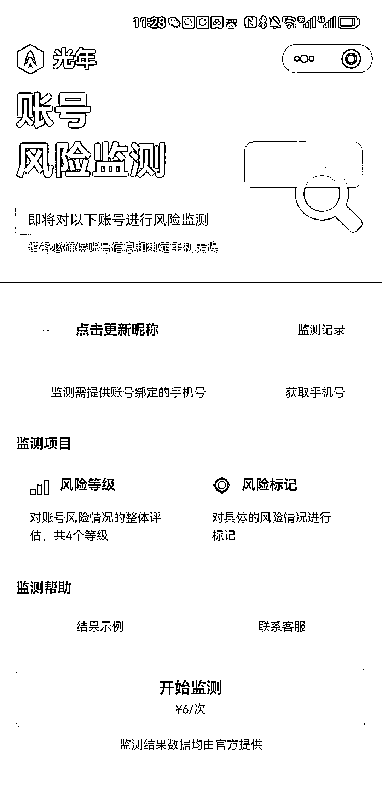
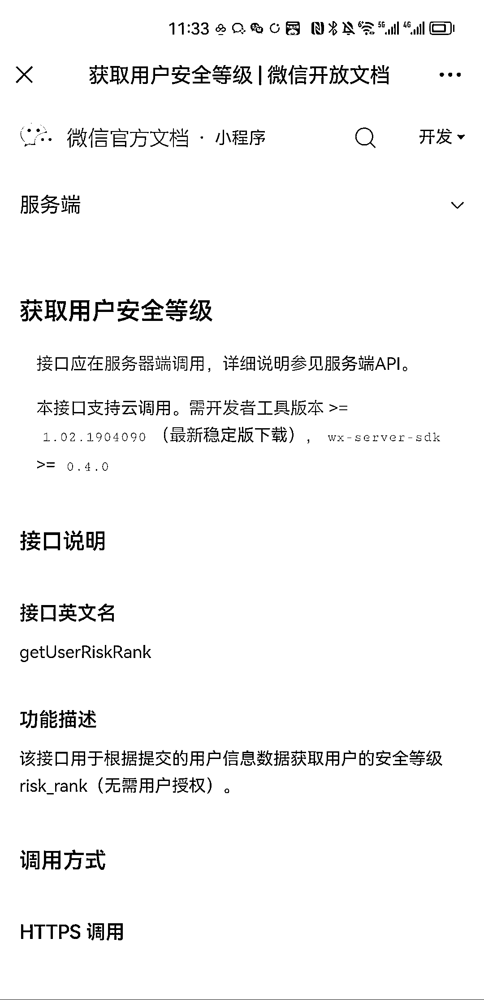

# 查询微信安全等级，6 元一次，可开发 h5

> 原文：[`www.yuque.com/for_lazy/xkrm14/ruwvwdym6dbfgsfp`](https://www.yuque.com/for_lazy/xkrm14/ruwvwdym6dbfgsfp)

作者： 郭耀天

日期：2023-03-29

点赞数：48

正文：

光年实验室开发一个产品，查看微信安全等级，其实这个接口官方就有，开发下就可以使用，目前查询一次需要 6 元钱，如果开发加入分销，是不是裂变会更快，懂技术可以开发 h5 出来，应该可以搞一把 获取用户安全等级+|+微信开放文档 center/safety-control-capability/getUserRiskRank.html)

  

  

  

评论区：

白露听雨 : 太骚了，这也能赚钱，我们用这个接口来拦截羊毛党的

Sunwei : 今天也收到光年的私信了

不期而遇 : 对这些不太懂，想问一下这个微信风险等级，具体作用有哪些呢？举个例子，比如分 5 级，是风险等级到了一定程度（3 级）会被封号吗？

郭耀天 : 速度上

正宇 : 太骚了，我今天也收到信息了，

+龙 : 这种一举报就没

花满楼 : 这个风险等级是干什么用呢

公众号懒人找资源，懒人专属群分享

</ne-p></ne-p></ne-p>