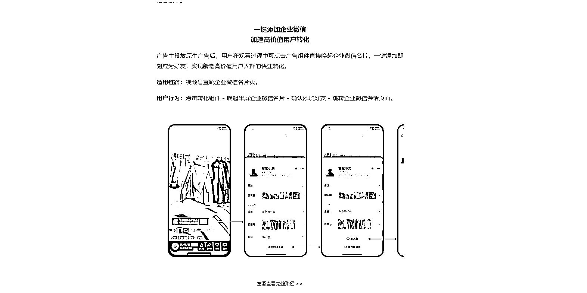
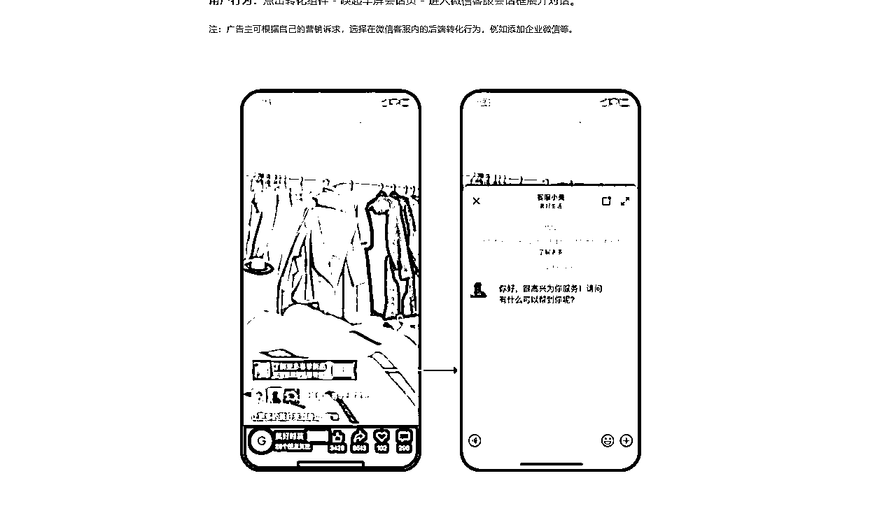

# 视频号直接跳转企业微信和微信客服的办法

> 原文：[`www.yuque.com/for_lazy/xkrm14/tezv1ar0sfzvkrnh`](https://www.yuque.com/for_lazy/xkrm14/tezv1ar0sfzvkrnh)

<ne-p id="ua10c8fb9" data-lake-id="ua10c8fb9"><ne-text id="u39c86c3a">作者： 侠狼</ne-text></ne-p> <ne-p id="ufc266f59" data-lake-id="ufc266f59"><ne-text id="u3bc85165">日期：2023-03-29</ne-text></ne-p> <ne-p id="uc3efcf8c" data-lake-id="uc3efcf8c"><ne-text id="ue6d12091">点赞数：</ne-text><ne-text id="ub173d237" ne-bold="true">12</ne-text></ne-p> <ne-hole id="ubc8c0017" data-lake-id="ubc8c0017"><ne-card data-card-name="hr" data-card-type="block" id="R92jB" data-event-boundary="card"><ne-p id="u1d47694a" data-lake-id="u1d47694a"><ne-text id="u70d8a38a">正文：</ne-text></ne-p> <ne-p id="u1372eabc" data-lake-id="u1372eabc"><ne-text id="u0db31cb6">视频号直跳企业微信和微信客服链路上线 私域进一步增强，进一步打造视频号，转化更加简单了，具体的开户操作对接步骤看如下 原文地址：</ne-text> <ne-text id="u981f8f84">私域转化更丝滑了视频号直跳企业微信和微信客服链路上线 <ne-text id="ub612d2e7">sCFA)</ne-text></ne-p> <ne-p id="uc0c1e131" data-lake-id="uc0c1e131"><ne-card data-card-name="image" data-card-type="inline" id="PZvXv" data-event-boundary="card">  <ne-p id="ud3dba98e" data-lake-id="ud3dba98e"><ne-card data-card-name="image" data-card-type="inline" id="vjhtL" data-event-boundary="card">  <ne-p id="ud625c1c4" data-lake-id="ud625c1c4"><ne-card data-card-name="image" data-card-type="inline" id="bO0wQ" data-event-boundary="card">  <ne-hole id="u9ba73535" data-lake-id="u9ba73535"><ne-card data-card-name="hr" data-card-type="block" id="HZNT4" data-event-boundary="card"><ne-p id="ufbbc6be2" data-lake-id="ufbbc6be2"><ne-text id="u5079832b">评论区：</ne-text></ne-p> <ne-hole id="ucd957db8" data-lake-id="ucd957db8"><ne-card data-card-name="hr" data-card-type="block" id="b7Yju" data-event-boundary="card"><ne-p id="u9a055780" data-lake-id="u9a055780"><ne-text id="u874756e5">公众号懒人找资源，懒人专属群分享</ne-text></ne-p></ne-card></ne-hole></ne-card></ne-hole></ne-card></ne-p></ne-card></ne-p></ne-card></ne-p></ne-card></ne-hole>