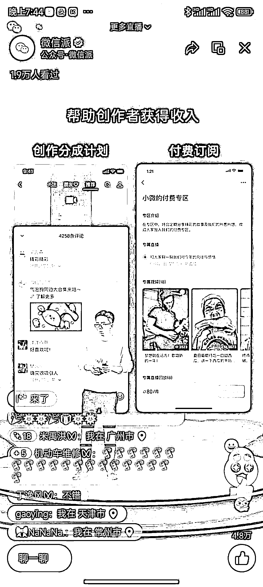

# 微信公开课剧透视频号 23 年变现功能

> 原文：[`www.yuque.com/for_lazy/xkrm14/hc71o28ipicshml6`](https://www.yuque.com/for_lazy/xkrm14/hc71o28ipicshml6)

<ne-p id="ub1c55a14" data-lake-id="ub1c55a14"><ne-text id="uef84bd25">作者： 蓝弈</ne-text></ne-p> <ne-p id="u28756ab7" data-lake-id="u28756ab7"><ne-text id="u0fc4e161">日期：2023-03-28</ne-text></ne-p> <ne-p id="uc4e0ebff" data-lake-id="uc4e0ebff"><ne-text id="u06825d46">点赞数：</ne-text><ne-text id="u6e4466ed" ne-bold="true">22</ne-text></ne-p> <ne-hole id="u1fa139e0" data-lake-id="u1fa139e0"><ne-card data-card-name="hr" data-card-type="block" id="wMjPG" data-event-boundary="card"><ne-p id="u2956a5b2" data-lake-id="u2956a5b2"><ne-text id="ue23b0e78">正文：</ne-text></ne-p> <ne-p id="u6d0d2573" data-lake-id="u6d0d2573"><ne-text id="u439216a3">微信公开课剧透视频号 23 年变现功能 1.新增创作者分成计划和付费订阅 2.长音频作品</ne-text></ne-p> <ne-p id="uea876a1a" data-lake-id="uea876a1a"><ne-card data-card-name="image" data-card-type="inline" id="fILew" data-event-boundary="card">  <ne-hole id="u75f73b33" data-lake-id="u75f73b33"><ne-card data-card-name="hr" data-card-type="block" id="HbDBC" data-event-boundary="card"><ne-p id="u28599ac6" data-lake-id="u28599ac6"><ne-text id="u9202f6e4">评论区：</ne-text></ne-p> <ne-hole id="u580ff089" data-lake-id="u580ff089"><ne-card data-card-name="hr" data-card-type="block" id="Fwcv0" data-event-boundary="card"><ne-p id="u6f220d93" data-lake-id="u6f220d93"><ne-text id="ufa0988e3">公众号懒人找资源，懒人专属群分享</ne-text></ne-p></ne-card></ne-hole></ne-card></ne-hole></ne-card></ne-p></ne-card></ne-hole>