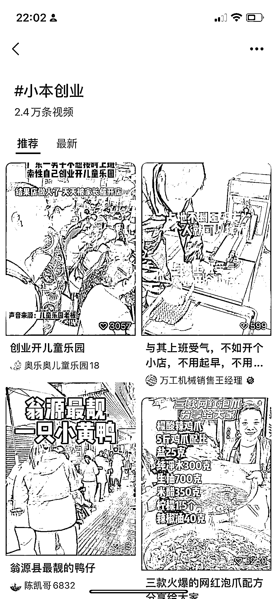

# 视频号里发现很多下沉市场的需求

> 原文：[`www.yuque.com/for_lazy/xkrm14/tmzyt9zg48shxtgi`](https://www.yuque.com/for_lazy/xkrm14/tmzyt9zg48shxtgi)

作者： 韩十七

日期：2023-03-27

点赞数：28

<ne-hole id="ue57f8908" data-lake-id="ue57f8908"><ne-card data-card-name="hr" data-card-type="block" id="e79sd" data-event-boundary="card">

正文：

刷视频号，刷到一个标签，打开了以后会发现很多下沉市场的需求，包括评论区也是精准的创业粉丝。 可以根据自己热度比较好的，看一下资源方，对于生财的朋友们来说，大概率都能直接找到供应商。

<ne-card data-card-name="image" data-card-type="inline" id="o26Ko" data-event-boundary="card"></ne-card>

<ne-hole id="u49839212" data-lake-id="u49839212"><ne-card data-card-name="hr" data-card-type="block" id="xMTdd" data-event-boundary="card">

评论区：

淘气猫 : 小成本创业，引流卖工具 卖课

<ne-hole id="ubc2fdc70" data-lake-id="ubc2fdc70"><ne-card data-card-name="hr" data-card-type="block" id="c4mCs" data-event-boundary="card">

公众号懒人找资源，懒人专属群分享

</ne-card></ne-hole></ne-card></ne-hole></ne-card></ne-hole>