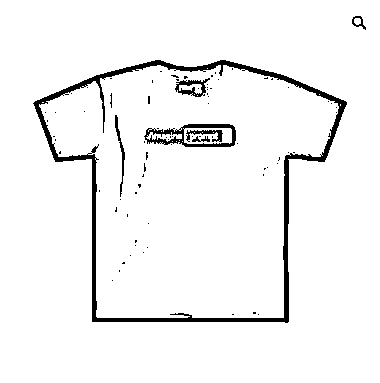

# Midjourney 的提示词样式衣服

> 原文：[`www.yuque.com/for_lazy/xkrm14/ouirtafi7nsnm12t`](https://www.yuque.com/for_lazy/xkrm14/ouirtafi7nsnm12t)

<ne-p id="u4017a97c" data-lake-id="u4017a97c"><ne-text id="u41551468">作者： 吴东子</ne-text></ne-p> <ne-p id="ue9f169b9" data-lake-id="ue9f169b9"><ne-text id="uf196ac5d">日期：2023-04-14</ne-text></ne-p> <ne-p id="u16da9fb7" data-lake-id="u16da9fb7"><ne-text id="u57e27e07">点赞数：</ne-text><ne-text id="u6e31bf27" ne-bold="true">84</ne-text></ne-p> <ne-hole id="u0a4ea401" data-lake-id="u0a4ea401"><ne-card data-card-name="hr" data-card-type="block" id="JlIMW" data-event-boundary="card"><ne-p id="uff6feb47" data-lake-id="uff6feb47"><ne-text id="u83fb6afd">正文：</ne-text></ne-p> <ne-p id="ub83b4054" data-lake-id="ub83b4054"><ne-text id="u2240f096">我是东子，今天给大家推荐一个风向标 【Midjourney 的提示词样式衣服】 价格：25 刀！ 颜色：黑白灰，灰色已经卖售罄！</ne-text> <ne-text id="u94e9c87f">感受：我觉得这个衣服很酷！很潮流！如果价格合适的话我也会买，就是享受那种“我不需要所有人知道，但别人知道 MJ 的话就会觉得我很酷！</ne-text> <ne-text id="u8cdd6504">思考一：外国已经有人在卖并取得了成绩，国内的衣服厂商也可以动起来了，不过需要思考这套模式在中国能不能走通？</ne-text> <ne-text id="u1c0ae31f">思考二：除了 MJ 这个提示词样式，还有什么样式，ChatGPT 行不行？等等 希望能给大家带来启发！</ne-text></ne-p> <ne-p id="u96424a3e" data-lake-id="u96424a3e"><ne-card data-card-name="image" data-card-type="inline" id="u2t1b" data-event-boundary="card">  <ne-p id="uf3f68c50" data-lake-id="uf3f68c50"><ne-card data-card-name="image" data-card-type="inline" id="IadHk" data-event-boundary="card">  <ne-p id="u76d963f9" data-lake-id="u76d963f9"><ne-card data-card-name="image" data-card-type="inline" id="N3DTj" data-event-boundary="card">  <ne-hole id="u97ff3146" data-lake-id="u97ff3146"><ne-card data-card-name="hr" data-card-type="block" id="tHoO4" data-event-boundary="card"><ne-p id="u3a3b7981" data-lake-id="u3a3b7981"><ne-text id="u243203a5">评论区：</ne-text></ne-p> <ne-p id="u20306ebf" data-lake-id="u20306ebf"><ne-text id="u5cc9c812">吴东子 : 网址在这：</ne-text>[<ne-text id="ud36372f5">Prompter+Guide</ne-text>](https://prompterguide.com/)</ne-p> <ne-p id="uf0f0e3c0" data-lake-id="uf0f0e3c0"><ne-text id="ua2b83428">东东.Michael : 还可以定制，给 promt 指导定制 t</ne-text></ne-p> <ne-p id="ubb8541d1" data-lake-id="ubb8541d1"><ne-text id="u2df635e1">蔚露 : 做个加法，正面不变，有详细提示词，背面是图，情侣衫，班服……</ne-text></ne-p> <ne-p id="ubc2e756f" data-lake-id="ubc2e756f"><ne-text id="u10a5908e">徐同学 : 太秀了</ne-text></ne-p> <ne-p id="u53d24b7e" data-lake-id="u53d24b7e"><ne-text id="u93aad2e2">金九渊 : 正面写上提示词加图片？</ne-text></ne-p> <ne-p id="ua2ef1e34" data-lake-id="ua2ef1e34"><ne-text id="u858494eb">Scott :</ne-text></ne-p> <ne-p id="ue82094f5" data-lake-id="ue82094f5"><ne-text id="ucf933ddb">亦仁 : 中标，术值 +1。 点击最上方 #中标 专栏，可查看所有中标风向标。</ne-text></ne-p> <ne-hole id="u33cfc990" data-lake-id="u33cfc990"><ne-card data-card-name="hr" data-card-type="block" id="Js4hL" data-event-boundary="card"><ne-p id="u3974c919" data-lake-id="u3974c919"><ne-text id="u521e8f92">公众号懒人找资源，懒人专属群分享</ne-text></ne-p></ne-card></ne-hole></ne-card></ne-hole></ne-card></ne-p></ne-card></ne-p></ne-card></ne-p></ne-card></ne-hole>