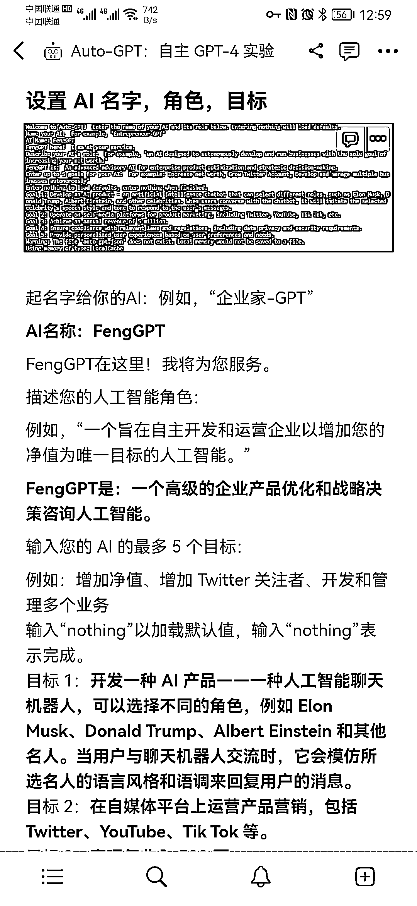
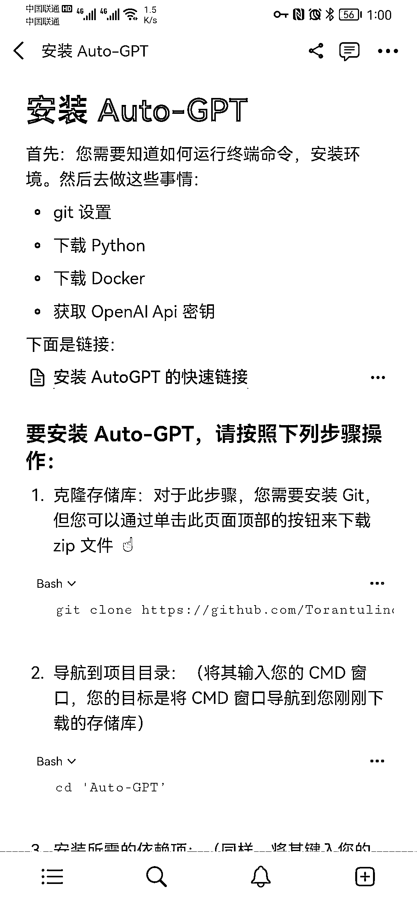
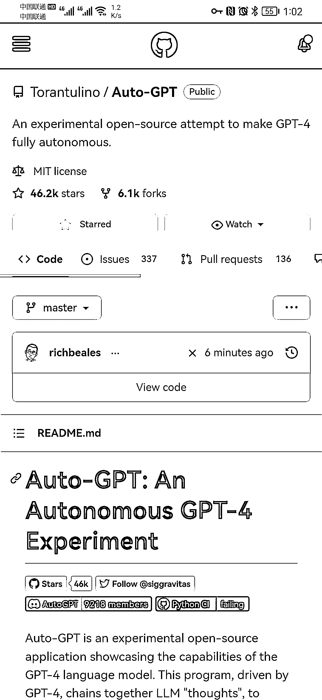

# 从 ChatGPT 到 Auto-GPT：自主 AI 的下一个演变正在发生

> 原文：[`www.yuque.com/for_lazy/xkrm14/ogs1wt9hoisrs5fa`](https://www.yuque.com/for_lazy/xkrm14/ogs1wt9hoisrs5fa)

作者： 元峰

日期：2023-04-14

点赞数：119

正文：

从 ChatGPT 到 Auto-GPT：探索正在改变游戏规则，自主 AI 的下一个演变正在发生。 Auto-GPT 是一种新的应用程序，它允许 AI 自主行动，可以“自我提示”，它正在彻底改变我们对这项技术的看法。 GitHub 已经 46.2K ⭐了。今天安装跑了一遍，再一次被震撼到，有的人 ChatGPT 都还没用，人家全自动的已经出来了。 打个不恰当的比方，ChatGPT 是火车🚞，GPT4 是高铁🚅，AutoGPT 就是磁悬浮。 记录了一下完整的过程。移步 Notion 查看。 [Notion+–+The+all-in-one+workspace+for+your+notes,+... ](https://endurable- espadrille-3ea.notion.site/Auto-GPT-GPT-4-e1f4388ac64b418a945fcf5bcd3593ea)

  

  

  

  

评论区：

刘一笔 : 我觉得这个比喻不够准确。 autogpt 我认为是会主动对自己思考进行思考的 chatgpt。

财女小马达 : 同感

城 : 然后 Ai 还比人聪明，自己做一个月赚 1 万，它做一个月赚 2 万。 也就是你不用 Auto-Ai 做生意，每月相当于亏了一万。 所以，这玩意好使的话，就成必需品了…期待又害怕

城 : 换个比喻就是： 以前面朝黄土背朝天； 现在大型农机具田边看着它干。

元峰 : 我这个比喻指是提升效率方面吧。AutoGPT 迷人之处就是给定身份和目标之后，AI 自动思考，自动拆解任务，自动执行。如果说把贾维斯当做 AI 的终极呈现，AutoGPT 算是迈出了一小步吧。

kcswag : 我倒是感觉目前的 autogpt 更像一个实习生，没有经验，傻头傻脑穷尽一切笨办法

亦仁 : 中标，术值 +1。 点击最上方 #中标 专栏，可查看所有中标风向标。

公众号懒人找资源，懒人专属群分享

