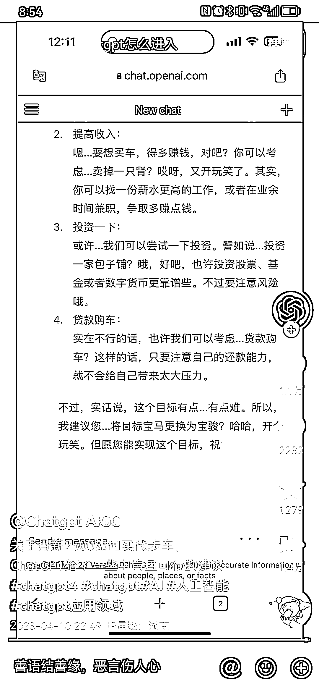
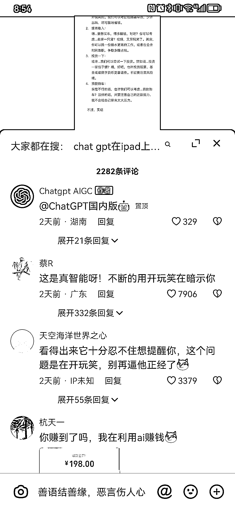

# 抖音把 GPT 调教成幽默诙谐的回答方式，能更好提高数据

> 原文：[`www.yuque.com/for_lazy/xkrm14/uwwuxmg53iuty50p`](https://www.yuque.com/for_lazy/xkrm14/uwwuxmg53iuty50p)

<ne-p id="u7bddaa17" data-lake-id="u7bddaa17"><ne-text id="u17ccfc50">作者： 卓桐</ne-text></ne-p> <ne-p id="u5101f6ee" data-lake-id="u5101f6ee"><ne-text id="ub6ed567d">日期：2023-04-13</ne-text></ne-p> <ne-p id="u141ed0c2" data-lake-id="u141ed0c2"><ne-text id="u9cf49184">点赞数：</ne-text><ne-text id="u437dbb74" ne-bold="true">69</ne-text></ne-p> <ne-hole id="u36137b8a" data-lake-id="u36137b8a"><ne-card data-card-name="hr" data-card-type="block" id="UINPm" data-event-boundary="card"><ne-p id="u09ec78e0" data-lake-id="u09ec78e0"><ne-text id="u01203c99">正文：</ne-text></ne-p> <ne-p id="u6917dd6c" data-lake-id="u6917dd6c"><ne-text id="uc88a217a">利用 gpt 做内容引流，可把 gpt 调教成更幽默诙谐的回答方式，问题也需要和大众切身相关。这样能更好提高数据。</ne-text></ne-p> <ne-p id="uc3bf292d" data-lake-id="uc3bf292d"><ne-card data-card-name="image" data-card-type="inline" id="GJ6Z2" data-event-boundary="card">  <ne-p id="uf768d7f6" data-lake-id="uf768d7f6"><ne-card data-card-name="image" data-card-type="inline" id="O6KJI" data-event-boundary="card">  <ne-p id="uc884a17e" data-lake-id="uc884a17e"><ne-card data-card-name="image" data-card-type="inline" id="vNWcu" data-event-boundary="card">  <ne-hole id="uc73bac68" data-lake-id="uc73bac68"><ne-card data-card-name="hr" data-card-type="block" id="zRI6w" data-event-boundary="card"><ne-p id="u10b0a2c7" data-lake-id="u10b0a2c7"><ne-text id="u10252763">评论区：</ne-text></ne-p> <ne-p id="u3fd2d9b2" data-lake-id="u3fd2d9b2"><ne-text id="u554352d3">财女小马达 : 用起来很强大</ne-text></ne-p> <ne-p id="ub1db772a" data-lake-id="ub1db772a"><ne-text id="ua78f9bf7">闲米 : 第四个引流也很厉害</ne-text></ne-p> <ne-p id="u0274a730" data-lake-id="u0274a730"><ne-text id="u27d45fe8">壹千 : 图三 chatgpt 国内版这个是帮别人引流拿佣金？还是自己的小程序？</ne-text></ne-p> <ne-p id="u7cd5558b" data-lake-id="u7cd5558b"><ne-text id="u04ca2c69">卓桐 : 导小号引流</ne-text></ne-p> <ne-p id="u299cc375" data-lake-id="u299cc375"><ne-text id="uf0fdec98">壹千 : 懂了</ne-text></ne-p> <ne-p id="u5b45df30" data-lake-id="u5b45df30"><ne-text id="u9f9461fa">亦仁 : 中标，术值 +1。 点击最上方 #中标 专栏，可查看所有中标风向标。</ne-text></ne-p> <ne-hole id="u92591d4d" data-lake-id="u92591d4d"><ne-card data-card-name="hr" data-card-type="block" id="QUAKf" data-event-boundary="card"><ne-p id="u61a74b15" data-lake-id="u61a74b15"><ne-text id="u4c71a55b">公众号懒人找资源，懒人专属群分享</ne-text></ne-p></ne-card></ne-hole></ne-card></ne-hole></ne-card></ne-p></ne-card></ne-p></ne-card></ne-p></ne-card></ne-hole>