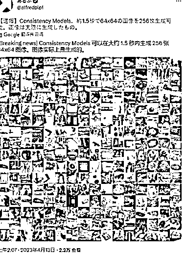
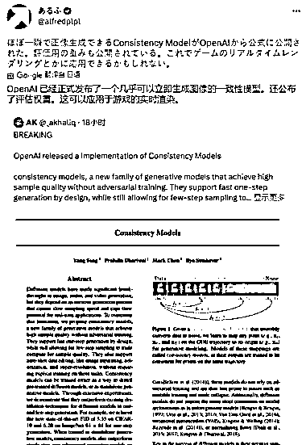
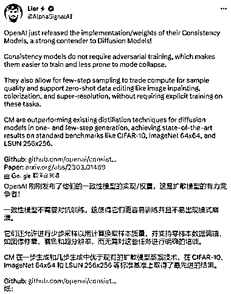
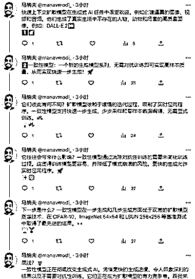

# 新的 AI 绘图模型 Consistency models 诞生

> 原文：[`www.yuque.com/for_lazy/xkrm14/teq5n7g9pidd5390`](https://www.yuque.com/for_lazy/xkrm14/teq5n7g9pidd5390)

作者： 来说 Web3

日期：2023-04-13

点赞数：43

正文：

新的 AI 绘图模型 Consistency models(一致性模型)诞生，openAI 研发 优势： 1》Stable diffusion 和 Midjourney 出图要慢慢渲染慢慢细化，这个一致性模型据说可以一步到位。 2》根据日本网友初步评测，高达 18fps，相当于 3.5 秒可以出 64 张 256x256 大小的图； 3》该模型还支持零样本图像编辑，修改现有图像不需要任何额外训练和数据。 以上借用大嫂的话，下面我增加一些推特的报道，后续结果以实测为准 文件链接：github.com/openai/consistency_models 我也在尝试安装，第 8 副图就是，请静待教程

  

  

  

  

  

  

  

  

评论区：

cck : 我们已经在训练自己的模型了

番茄🍅 : 基于 stable diffusion 还是已经基于一致性模型了😄

cck : 一致性模型还在训练

亦仁 : 中标，术值 +1。 点击最上方 #中标 专栏，可查看所有中标风向标。

公众号懒人找资源，懒人专属群分享

</ne-p></ne-p></ne-p></ne-p></ne-p></ne-p></ne-p></ne-p>