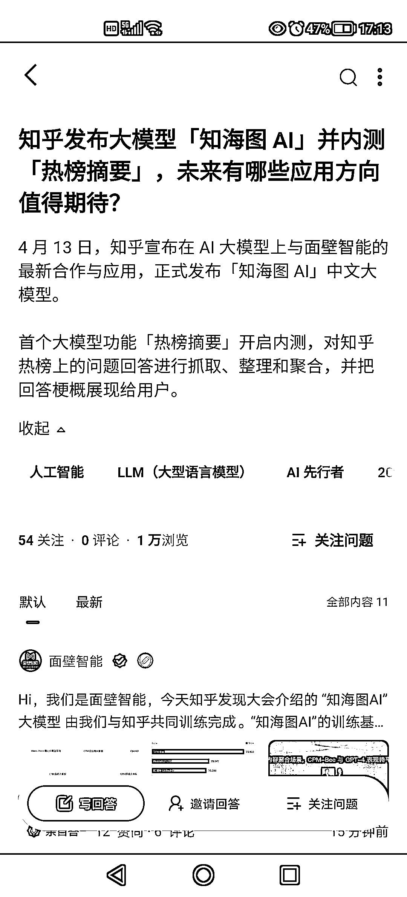
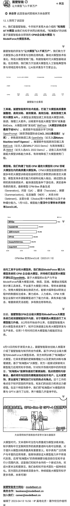

# 知乎发布大模型—知海图 AI，内测功能

> 原文：[`www.yuque.com/for_lazy/xkrm14/vg777ei7w7fnw8ik`](https://www.yuque.com/for_lazy/xkrm14/vg777ei7w7fnw8ik)

<ne-text id="u63663368">作者： 小鲸鱼</ne-text>

<ne-text id="uf095c11d">日期：2023-04-13</ne-text>

<ne-text id="ub89c56a6">点赞数：</ne-text><ne-text id="u985e774b" ne-bold="true">29</ne-text>

<ne-hole id="u6ae16bb5" data-lake-id="u6ae16bb5"><ne-card data-card-name="hr" data-card-type="block" id="aRhH9" data-event-boundary="card">

<ne-text id="u7cbf2d41">正文：</ne-text>

<ne-text id="u493ef981">4 月 13 号，知乎发布大模型—知海图 AI，内测功能 [ 热榜摘要 ]</ne-text>

<ne-card data-card-name="image" data-card-type="inline" id="nyatd" data-event-boundary="card">  <ne-p id="uf9d8c1ee" data-lake-id="uf9d8c1ee"><ne-card data-card-name="image" data-card-type="inline" id="phG4Z" data-event-boundary="card">  <ne-p id="u3ec82c15" data-lake-id="u3ec82c15"><ne-card data-card-name="image" data-card-type="inline" id="NcHAJ" data-event-boundary="card">  <ne-hole id="u330cb9ff" data-lake-id="u330cb9ff"><ne-card data-card-name="hr" data-card-type="block" id="bLk7r" data-event-boundary="card"><ne-p id="ud02e785e" data-lake-id="ud02e785e"><ne-text id="u881fe608">评论区：</ne-text>

<ne-text id="ub0098fa0">小光 : 好家伙面壁智能，过两天是不是该出来破壁人了[憨笑]</ne-text>

<ne-text id="u3ee82ead">亦仁 : 中标，术值 +1。 点击最上方 #中标 专栏，可查看所有中标风向标。</ne-text>

<ne-text id="ud58252e6">小鲸鱼 : 耶✌谢谢亦仁老大</ne-text>

<ne-hole id="ua4aa9769" data-lake-id="ua4aa9769"><ne-card data-card-name="hr" data-card-type="block" id="h1zw0" data-event-boundary="card">

<ne-text id="u0ffcf6cf">公众号懒人找资源，懒人专属群分享</ne-text>

</ne-card></ne-hole></ne-card></ne-hole></ne-card></ne-p></ne-card></ne-p></ne-card></ne-p></ne-card></ne-hole>