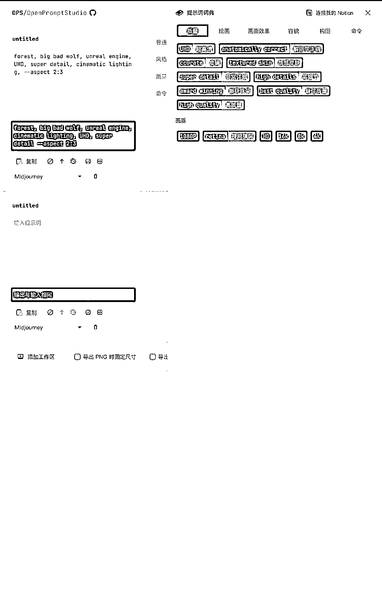

# OpenPromptStudio：开源 AIGC 提示词可视化编辑器

> 原文：[`www.yuque.com/for_lazy/xkrm14/qsoxml02i0mb3tgy`](https://www.yuque.com/for_lazy/xkrm14/qsoxml02i0mb3tgy)

<ne-p id="u9b6233be" data-lake-id="u9b6233be"><ne-text id="u98dcc804">作者： 林中灰兔</ne-text></ne-p> <ne-p id="u9d7d7dbd" data-lake-id="u9d7d7dbd"><ne-text id="u91794d05">日期：2023-04-12</ne-text></ne-p> <ne-p id="uca1eaba9" data-lake-id="uca1eaba9"><ne-text id="u91647f63">点赞数：</ne-text><ne-text id="u489e31a8" ne-bold="true">80</ne-text></ne-p> <ne-hole id="u5a0411e9" data-lake-id="u5a0411e9"><ne-card data-card-name="hr" data-card-type="block" id="gIKa8" data-event-boundary="card"><ne-p id="uc36b1db1" data-lake-id="uc36b1db1"><ne-text id="u8aeb76d5">正文：</ne-text></ne-p> <ne-p id="u407c950f" data-lake-id="u407c950f"><ne-text id="uffbf82fb">OpenPromptStudio：开源 AIGC 提示词可视化编辑器 项目地址： 体验地址： 局限于英语水平和描述水平，很多人往往不能准确地通过</ne-text> <ne-text id="u43863a3b">Prompt 得到想要的图像，而 OpenPromptStudio 能够很好地帮助我们解决这个问题 - 支持 Midjourney 和 Stable</ne-text> <ne-text id="uaf0e603d">Diffusion - 显示英文提示词的中文翻译 - 翻译输入的中文提示词到英文 - 为提示词进行分类（普通、样式、质量、命令） -</ne-text> <ne-text id="uef9039c4">轻松的排序、隐藏提示词 - 把提示词可视化结果导出为图片 - 常用提示词词典 - 通过 Notion</ne-text> <ne-text id="uddf75f3a">管理提示词词典</ne-text>[<ne-text id="uaa93a885">GitHub+-+Moonvy/OpenPromptStudio:+🥣+AIGC+提示词可视化编辑器</ne-text>](https://github.com/Moonvy/OpenPromptStudio) [<ne-text id="u593470ed">OPS+提示词工作室+|+可视化编辑提示词+|+一键翻译+AIGC+提示词+|+Midjourney...</ne-text>](https://moonvy.com/apps/ops/)</ne-p> <ne-p id="u6b6651a1" data-lake-id="u6b6651a1"><ne-card data-card-name="image" data-card-type="inline" id="IxvuH" data-event-boundary="card"></ne-card></ne-p> <ne-hole id="ud99f3d02" data-lake-id="ud99f3d02"><ne-card data-card-name="hr" data-card-type="block" id="roQi4" data-event-boundary="card"><ne-p id="ube819a6a" data-lake-id="ube819a6a"><ne-text id="ua91f6011">评论区：</ne-text></ne-p> <ne-p id="u2ca64f28" data-lake-id="u2ca64f28"><ne-text id="uf1e361fd">春风王锐 : NB，刚在其他地方看到，想要发风向标的，就看到你发的了</ne-text></ne-p> <ne-p id="ubea7a639" data-lake-id="ubea7a639"><ne-text id="u344eb284">林中灰兔 : 哈哈，赶巧了不是</ne-text></ne-p> <ne-p id="u23dd8c27" data-lake-id="u23dd8c27"><ne-text id="u862974d1">春风王锐 : 必须的，太火了</ne-text></ne-p> <ne-p id="u914a7fde" data-lake-id="u914a7fde"><ne-text id="uf0e4616f">晓岚 : 这个思路好棒，在别人卷 ai 绘画的时候，帮助别人更好的卷 ai 绘画</ne-text></ne-p> <ne-hole id="u42342fca" data-lake-id="u42342fca"><ne-card data-card-name="hr" data-card-type="block" id="hsB8g" data-event-boundary="card"><ne-p id="u4e707f76" data-lake-id="u4e707f76"><ne-text id="u30902981">公众号懒人找资源，懒人专属群分享</ne-text></ne-p></ne-card></ne-hole></ne-card></ne-hole></ne-card></ne-hole>