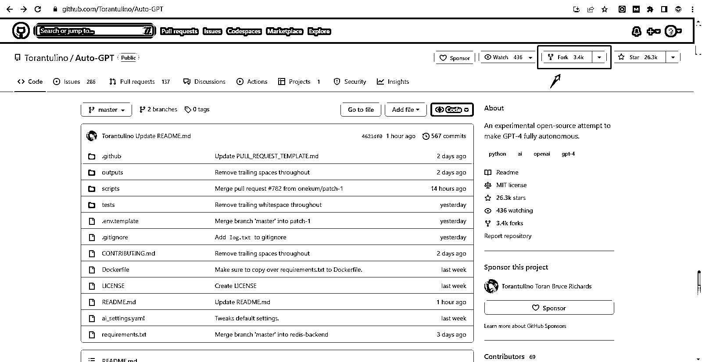
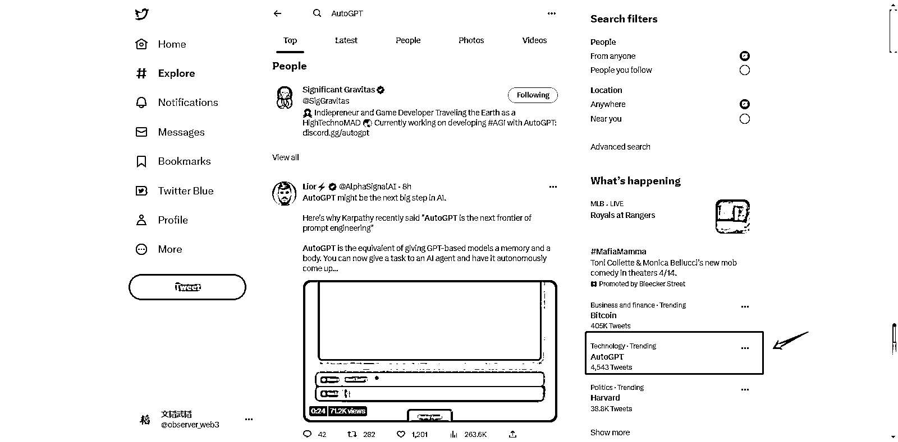

# AutoGPT 的 Twitter 热点，很可能是 AI 进化的第一次跃迁

> 原文：[`www.yuque.com/for_lazy/xkrm14/qmnq18yaddxi4ln5`](https://www.yuque.com/for_lazy/xkrm14/qmnq18yaddxi4ln5)

<ne-p id="uac531a2d" data-lake-id="uac531a2d"><ne-text id="ud922028c">作者： 文韬武韬</ne-text></ne-p> <ne-p id="ue8f25b89" data-lake-id="ue8f25b89"><ne-text id="ub3cb4a2f">日期：2023-04-12</ne-text></ne-p> <ne-p id="u175f456f" data-lake-id="u175f456f"><ne-text id="ua54c637b">点赞数：</ne-text><ne-text id="ub42b4fe4" ne-bold="true">28</ne-text></ne-p> <ne-hole id="u012e77d3" data-lake-id="u012e77d3"><ne-card data-card-name="hr" data-card-type="block" id="xTqlb" data-event-boundary="card"><ne-p id="ufb3da60c" data-lake-id="ufb3da60c"><ne-text id="ude7aeca2">正文：</ne-text></ne-p> <ne-p id="u96eb496e" data-lake-id="u96eb496e"><ne-text id="ue7178097">建议关注这个 AutoGPT 的 Twitter 热点，已经短时间内出现不少应用了，很可能是 AI 进化的第一次跃迁：</ne-text> <ne-text id="u8c0de426">（见附图，分别为 Twitter 的科技热点，和 github 上的数据） 短短两三天时间，基于 AutoGPT 的 XXXGPT 的自动程序，出来了一大堆。</ne-text> <ne-text id="u8ec9fe43">比如 AgentGPT，SEOGPT，ResearchGPT……</ne-text> <ne-text id="u673f7d77">这些程序的原理，简单来说，是利用 AI 自动安排任务列表，各子任务自动调用 API 接口，让 AI 程序 7*24 小时连续不中断的工作。 AutoGPT 的 github:</ne-text> <ne-text id="u1f8bc43a">这个 BabyAGI 的也很值得关注：</ne-text> [<ne-text id="u0eff7820">https://twitter.com/search?q=AutoGPT&src;=trend_cli...</ne-text>](https://twitter.com/search?q=AutoGPT&src=trend_click&vertical=trends) <ne-text id="u419087bc">GitHub+-+Torantulino/Auto-</ne-text> <ne-text id="u4501bef4">GPT:+An+experimental+ope... <ne-text id="u30a641f7">GPT)</ne-text>[<ne-text id="uda416d0e">GitHub+-+yoheinakajima/babyagi</ne-text>](https://github.com/yoheinakajima/babyagi)</ne-p> <ne-p id="u7f0a2e98" data-lake-id="u7f0a2e98"><ne-card data-card-name="image" data-card-type="inline" id="vUu0y" data-event-boundary="card"></ne-card></ne-p> <ne-p id="u27036429" data-lake-id="u27036429"><ne-card data-card-name="image" data-card-type="inline" id="nIhZy" data-event-boundary="card"></ne-card></ne-p> <ne-hole id="ud8dfdb3a" data-lake-id="ud8dfdb3a"><ne-card data-card-name="hr" data-card-type="block" id="JBDvD" data-event-boundary="card"><ne-p id="u93cbb9d0" data-lake-id="u93cbb9d0"><ne-text id="u33717b54">评论区：</ne-text></ne-p> <ne-p id="u32772a66" data-lake-id="u32772a66"><ne-text id="u11a041bb">文韬武韬 : 更新一下数据，昨天推特上，AutoGPT 已经有 9863 个 tweets</ne-text></ne-p> <ne-hole id="u9b152820" data-lake-id="u9b152820"><ne-card data-card-name="hr" data-card-type="block" id="wBmvq" data-event-boundary="card"><ne-p id="u6703e3ab" data-lake-id="u6703e3ab"><ne-text id="ue783b033">公众号懒人找资源，懒人专属群分享</ne-text></ne-p></ne-card></ne-hole></ne-card></ne-hole></ne-card></ne-hole>