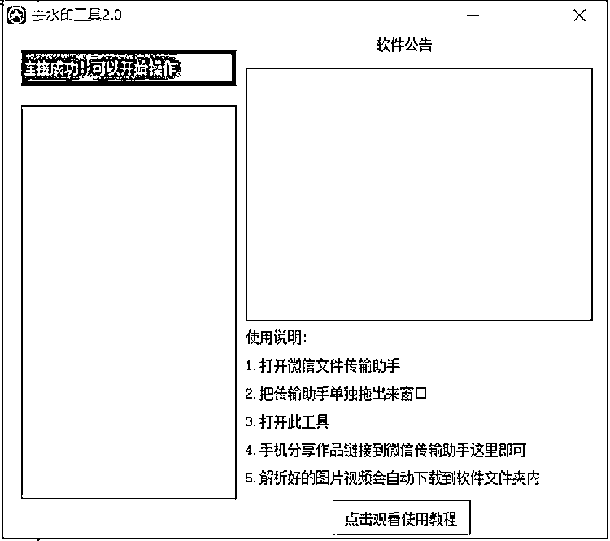

# 全自动去水印机器人 2.0

> 原文：[`www.yuque.com/for_lazy/xkrm14/fyus2kp2g4g52kuh`](https://www.yuque.com/for_lazy/xkrm14/fyus2kp2g4g52kuh)

作者： 三毛

日期：2023-04-12

点赞数：114

<ne-card data-card-name="hr" data-card-type="block" id="v44e9" data-event-boundary="card">

正文：

全自动去水印机器人 2.0 软件功能：手机分享短视频，图集作品链接到微信传输助手，全自动下载到电脑，方便快捷，节省手动操作时间。 目前支持：视频号，抖音，快手，小红书 生财的同学每个月都能领月卡，相当于免费使用。 [https://j28cw4imdh.feishu.cn/docx/A4SWdrFvCoAJrhxP...](https://j28cw4imdh.feishu.cn/docx/A4SWdrFvCoAJrhxPCSxcByfgnQe?from=from_copylink)

<ne-card data-card-name="image" data-card-type="inline" id="BA2wr" data-event-boundary="card"></ne-card>

<ne-card data-card-name="hr" data-card-type="block" id="LlpBH" data-event-boundary="card">

评论区：

Ven : 我写了个客户端版的😂

三毛 : 优秀[得意]

Ven : 你是通过服务器自己解析资源吗还是用别人的接口，还有怎么曝光产品变现呀😂

三毛 : 调用别人接口

Ven : 收费吗

三毛 : 不收费啊

三毛 : 可以私聊

My Dream : 感谢分享

<ne-card data-card-name="hr" data-card-type="block" id="W8O0B" data-event-boundary="card">

公众号懒人找资源，懒人专属群分享

</ne-card></ne-card></ne-card>