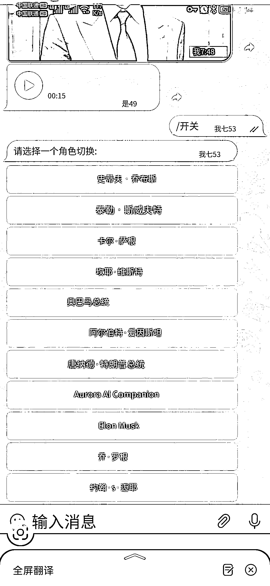

# Forever Voices AI 把两项 AI 技术合成出逼真的乔布斯声音

> 原文：[`www.yuque.com/for_lazy/xkrm14/xzig3y5nhqin3qzo`](https://www.yuque.com/for_lazy/xkrm14/xzig3y5nhqin3qzo)

<ne-p id="u924964f8" data-lake-id="u924964f8"><ne-text id="ufda36fb5">作者： 元峰</ne-text></ne-p> <ne-p id="uf978583c" data-lake-id="uf978583c"><ne-text id="uf27a60c7">日期：2023-04-12</ne-text></ne-p> <ne-p id="u95756341" data-lake-id="u95756341"><ne-text id="u2fee39b9">点赞数：</ne-text><ne-text id="ud95b2b12" ne-bold="true">55</ne-text></ne-p> <ne-hole id="ucac0e0ea" data-lake-id="ucac0e0ea"><ne-card data-card-name="hr" data-card-type="block" id="thPiS" data-event-boundary="card"><ne-p id="ucf716196" data-lake-id="ucf716196"><ne-text id="ued0dd30b">正文：</ne-text></ne-p> <ne-p id="u942b7c2f" data-lake-id="u942b7c2f"><ne-text id="u29a2ee35">怎么向乔布斯等名人提问，听他亲口回答你 Forever Voices AI 把两项 AI 技术结合，我问乔布斯任意一个问题后，ChatGPT</ne-text> <ne-text id="ud5db0100">生成答案、文字转语音 AI 合成出逼真的乔布斯声音。 电报测试地址： 现在关于 ChatGPT 的文字对话聊天机器人已经很卷，这种声音输出的还很少。</ne-text> <ne-text id="uc2e90369">现在出一款模仿中国名人声音的机器人，例如雷布斯，马云，老罗等等，与他们语音对话。内置在微信，QQ 等聊天软件中，按分钟收费，估计会破圈。</ne-text>[<ne-text id="udfb3276d">https://t.me/ForeverVoicesBot</ne-text>](https://t.me/ForeverVoicesBot)</ne-p> <ne-p id="u79a2027a" data-lake-id="u79a2027a"><ne-card data-card-name="image" data-card-type="inline" id="llyOq" data-event-boundary="card"></ne-card></ne-p> <ne-p id="u7c4d4fb0" data-lake-id="u7c4d4fb0"><ne-card data-card-name="image" data-card-type="inline" id="IF6iG" data-event-boundary="card"></ne-card></ne-p> <ne-p id="u224a0ea6" data-lake-id="u224a0ea6"><ne-card data-card-name="image" data-card-type="inline" id="NLSt4" data-event-boundary="card"></ne-card></ne-p> <ne-hole id="u7e816969" data-lake-id="u7e816969"><ne-card data-card-name="hr" data-card-type="block" id="ckrEQ" data-event-boundary="card"><ne-p id="uf9b2f206" data-lake-id="uf9b2f206"><ne-text id="ud843ec0a">评论区：</ne-text></ne-p> <ne-p id="u780c9a3d" data-lake-id="u780c9a3d"><ne-text id="u90f8d685">文卓 : 会不会被律师函警告[奸笑]</ne-text></ne-p> <ne-p id="ub6e9ed77" data-lake-id="ub6e9ed77"><ne-text id="u68953856">元峰 : 估计不会吧，他们公开演讲那么多。</ne-text></ne-p> <ne-p id="u4f9e0d55" data-lake-id="u4f9e0d55"><ne-text id="u230ca80b">平凡小吴 : 登录测试地址是需要魔法吗，登不上去啊[捂脸]</ne-text></ne-p> <ne-p id="u22139c1f" data-lake-id="u22139c1f"><ne-text id="uc48b6569">元峰 : 没错，也是个聊天软件。需要放眼看世界的🪜</ne-text></ne-p> <ne-hole id="u24b53749" data-lake-id="u24b53749"><ne-card data-card-name="hr" data-card-type="block" id="MHEVo" data-event-boundary="card"><ne-p id="u11162c68" data-lake-id="u11162c68"><ne-text id="uc6331032">公众号懒人找资源，懒人专属群分享</ne-text></ne-p></ne-card></ne-hole></ne-card></ne-hole></ne-card></ne-hole>