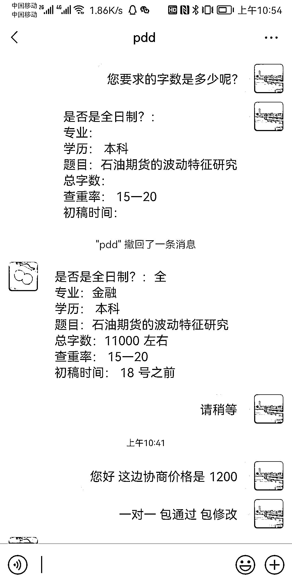
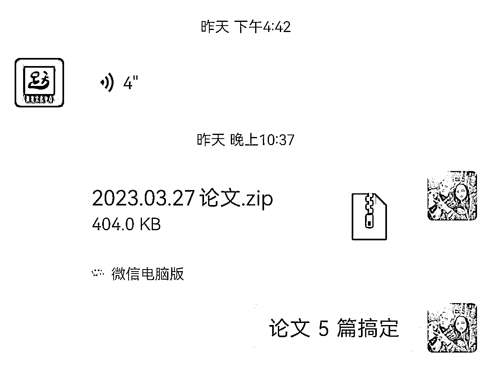
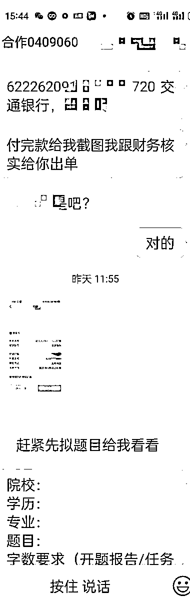
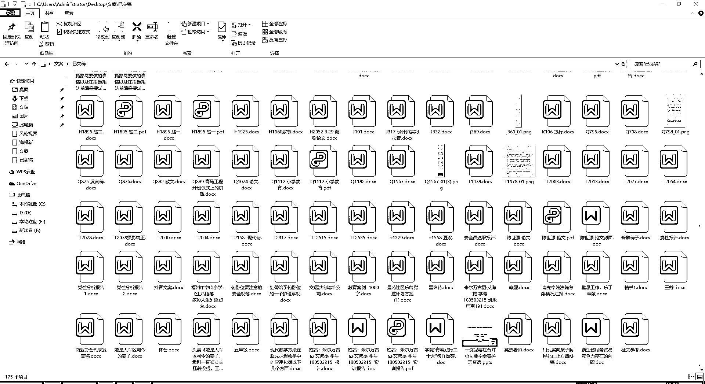
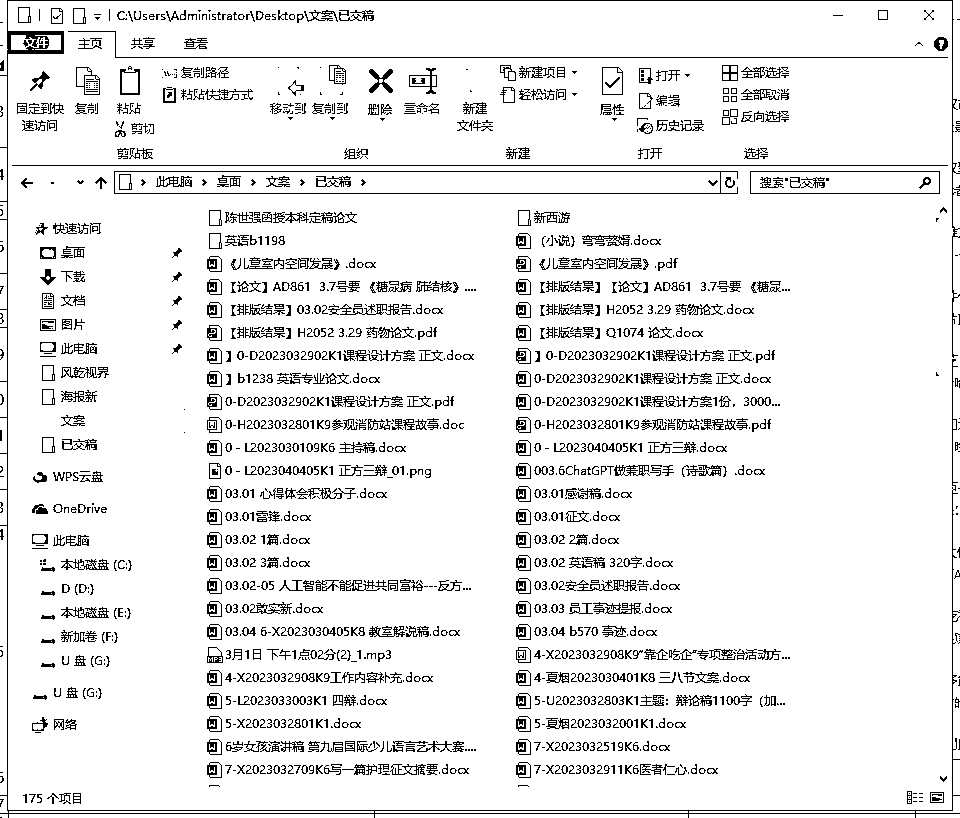

# 把 GPT 用在了代笔写作和论文辅导上，需求很大

> 原文：[`www.yuque.com/for_lazy/xkrm14/dyki6xsh0vglgzgn`](https://www.yuque.com/for_lazy/xkrm14/dyki6xsh0vglgzgn)

作者： 乾

日期：2023-04-10

点赞数：78

<ne-hole id="uf00077c3" data-lake-id="uf00077c3"><ne-card data-card-name="hr" data-card-type="block" id="DIfnS" data-event-boundary="card">

正文：

GPT 没有机会了吗？ 有的圈友觉得 GPT 已经非常火了，好像大家都在讨论，都用上了，已经没有什么机会了。但实际上，是你自己圈地自萌，你数数你在实际生活中，认识几个真的在用 GPT 当生产力的人了？ 我身边是一个都没有，也可能因为我身处传统行业，不在互联网圈子里。 又比如说我现在做的兼职代笔业务，有的朋友因为自己是 985 本科，硕士，眼睛总是向上看，觉得论文好难写，做不了。但其实海量的大专、专转本、函授教育学生，也有论文辅导需求，虽然是凑够字数即可，但对于他们来说，也是比较难的，毕竟这类学生最怕搞学术。 现在即使是不用答辩的函授论文，市场辅导价格都在 1200 元左右（图 1），砍砍价能到 800 元每篇。 我们把 GPT 用在了代笔写作和论文辅导上，GPT 是伟大的 equalizer，能抹平专业的差距。经过一百多人（都是兼职，不是专业老师）实践，1 小时以内 1 篇论文不是难事，需求大的时候每个老师 1 天 5 篇（图 3）。 有时候往外看，往下看，就能发现机会。

<ne-card data-card-name="image" data-card-type="inline" id="zLDcT" data-event-boundary="card"></ne-card>

<ne-card data-card-name="image" data-card-type="inline" id="USVh2" data-event-boundary="card"></ne-card>

<ne-card data-card-name="image" data-card-type="inline" id="qFNMN" data-event-boundary="card"></ne-card>

<ne-card data-card-name="image" data-card-type="inline" id="NUMxK" data-event-boundary="card"></ne-card>

<ne-card data-card-name="image" data-card-type="inline" id="fjiLt" data-event-boundary="card"></ne-card>

<ne-card data-card-name="image" data-card-type="inline" id="k7B5X" data-event-boundary="card"></ne-card>

<ne-hole id="u1b3b768f" data-lake-id="u1b3b768f"><ne-card data-card-name="hr" data-card-type="block" id="fUqxO" data-event-boundary="card">

评论区：

乾 : GPT 实战项目开发中，欢迎一起交流

大圣 : 这都是 gpt 写的吗 如何降重呢

乾 : 有方法的哦，不难

乾 : 生财有大神发过

大圣 : 好的好的 我研究下 谢谢😂

书情小跟班 : 加下

青衿 : 老哥文案兼职可以谈合作，这边有百家号官方渠道，一个月 15000 篇种草文案需求，vx：Testein1314

<ne-hole id="uf478a4e5" data-lake-id="uf478a4e5"><ne-card data-card-name="hr" data-card-type="block" id="axVav" data-event-boundary="card">

公众号懒人找资源，懒人专属群分享

</ne-card></ne-hole></ne-card></ne-hole></ne-card></ne-hole>